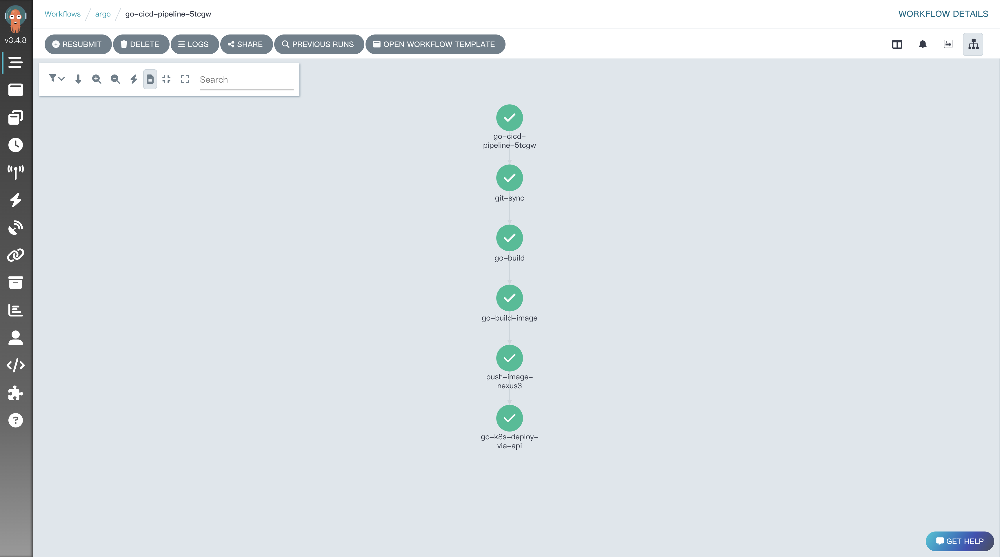

# pipeline-manifests

本仓库保存了基于argo workflows实现CI流水线的相关清单文件，包括

- 环境搭建
- 技术&设计文档
- 原子任务yaml
- 流水线yaml：基于原子任务yaml组装
- 其它如：secret、configmap、pv、pvc、role等等

举个例子，实现一个golang web项目的CICD流水线，一般步骤为：拉取代码 -> 构建 -> 构建镜像 -> 推送镜像 -> 部署，最终在argo workflows里面的效果如下：

