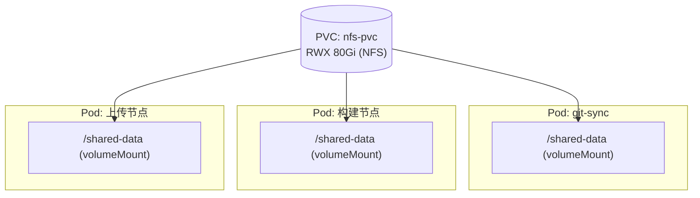
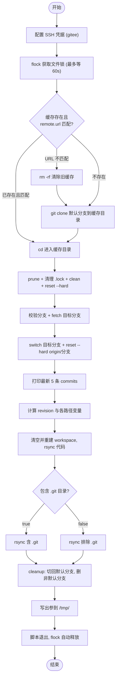

# git-sync 技术设计

> 清单文件：[git-sync.yaml](../../basetasktemplate/code/git-sync.yaml)

---

## 一、背景与定位

`git-sync` 是整条 CI/CD 流水线的**第一个节点**，也是后续所有构建/上传节点的**数据源头**。它负责：

1. 把 Git 仓库同步到 PVC 上的本地缓存（首次 `clone`，之后增量 `fetch`）；
2. 切换到目标分支并同步到远端最新；
3. 把代码 `rsync` 到本次运行专属的 workspace 目录，供后续构建节点使用；
4. 集中计算下游需要的各类路径、名称、时间戳等元数据，通过 `outputs` 向下游传递；
5. 对同一仓库的并发同步做互斥保护。

运行环境：k8s v1.23.3 + Argo Workflows v3.4.8 + Nexus3 + 基于 NFS 的共享 PVC。

---

## 二、设计目标

| 目标 | 说明 |
| --- | --- |
| **接口精简** | 只暴露必要入参，缓存/锁/workspace 路径都有合理默认，零参即可用 |
| **并发安全** | 用内核级 `flock` 做文件锁，从根本上消除竞态 |
| **环境贴合** | 代码源统一 Gitee（国内访问顺畅）；制品仓库统一 Nexus3，普通制品与镜像端口差异显式建模 |
| **幂等可重试** | rsync 前先清空 workspace，保证同一次运行重试后代码与产物一致 |
| **可观测** | 集中定义错误码、统一日志风格，便于上游区分错误类型 |
| **自包含** | 不依赖外部 configMap，颜色内置，可独立运行 |

---

## 三、整体架构

所有 Pod 挂载**同一个 NFS PVC** 到 `/shared-data`，文件系统层面天然共享，无需显式传文件。git-sync 产出的代码快照和元数据写在 PVC 上，后续构建/上传 Pod 直接读取。



**PVC 内目录结构：**

```
/shared-data/
├── git/                          # Git 仓库本地缓存（跨 pipeline 复用，增量 fetch）
│   └── {app-name}/               # 带 .git 的完整仓库
├── git-lock/                     # flock 锁文件目录
│   └── {app-name}.lock           # 锁文件（flock 载体）
└── workspace/                    # 每次 pipeline-run 的独立工作目录
    └── {pipeline-run-name}/
        └── git/                  # rsync 后的代码快照（默认不含 .git）
```

> PVC 的搭建（NFS Server、PV、PVC）见 [基于NFS的PV-PVC共享存储搭建.md](../存储/基于NFS的PV-PVC共享存储搭建.md)，对应清单 `pvc/nfs-pv.yaml`、`pvc/nfs-pvc.yaml`，PVC 名为 `nfs-pvc`。

---

## 四、运行前置条件（环境依赖）

| 依赖 | 说明 | 参考 |
| --- | --- | --- |
| k8s 集群 | v1.23.3，master 192.168.10.130 / worker 192.168.10.131 | [k8s搭建](../../环境搭建/k8s/v1.23.3.md) |
| Argo Workflows | v3.4.8，部署于 `argo` 命名空间 | [argo-workflows搭建](../../环境搭建/argo-workflows/v3.4.8.md) |
| 共享 PVC | `nfs-pvc`（RWX），挂载到 `/shared-data` | [NFS PV/PVC 搭建](../存储/基于NFS的PV-PVC共享存储搭建.md) |
| Nexus3 制品仓库 | 普通制品（raw-hosted 等）走 8081，镜像（docker-hosted）走 8082 | [nexus3搭建](../../环境搭建/制品仓库/nexus3搭建.md) |
| Gitee SSH 凭据 | Secret `gitee-ssh-secret`，含私钥 + SSH config | [gitee-ssh-secret.yaml](../../secrets/gitee-ssh-secret.yaml) |
| 基础镜像 | `yangtu/cix:0.1.0`（基于 alpine，预装 git/rsync/openssh/curl 等） | 见 4.1 |

### 4.1 基础镜像

使用 [yangtu/cix](https://hub.docker.com/repository/docker/yangtu/cix/general)（基于 cobra 的 CI 命令行工具镜像），运行时为 alpine:3.22，预装：`bash ca-certificates tzdata openssh sshpass git git-lfs rsync zip jq yq curl`，并在此基础上加装了 `coreutils`（支持 `%3N` 的 GNU date）与 `util-linux`（支持 `-w` 的 flock）。本模板需要的 `git` / `rsync` / `flock` / `openssh` / GNU `date` 均已具备。

> 国内拉取 Docker Hub 镜像可能较慢，可通过镜像加速器拉取，或在 worker 上预加载镜像后把清单里的 `imagePullPolicy` 改为 `Never`。

**时间戳精度：** 镜像已加装 `coreutils`，GNU `date` 支持 `%3N`，因此 `build-timestamp` 采用**毫秒级** `+%Y%m%d%H%M%S%3N`（17 位），唯一性更强、排序更友好。

---

## 五、入参设计（inputs）

| 参数名 | 默认值 | 必填 | 说明 |
| --- | --- | --- | --- |
| `app-name` | — | **是** | 应用唯一标识，作为缓存目录名、制品名、镜像 repo 路径的一部分 |
| `env` | `none` | 否 | 环境标识（dev/test/prod 等），构成制品/镜像路径 |
| `pipeline-run-name` | `{{workflow.name}}` | 否 | 本次运行名称，构建隔离的 workspace 子目录 |
| `git-url` | — | **是** | Gitee 仓库 SSH URL，如 `git@gitee.com:xxx/yyy.git` |
| `git-branch` | — | **是** | 目标构建分支 |
| `build-artifact-storage-repo` | `raw-hosted` | 否 | 普通制品仓库名（Nexus），如 raw-hosted、maven-hosted |
| `build-image-storage-repo` | `docker-hosted` | 否 | 镜像仓库名（Nexus），固定 docker-hosted |
| `git-repo-cache-dir` | `/shared-data/git` | 否 | PVC 上 Git 仓库本地缓存根目录 |
| `git-sync-lock-dir` | `/shared-data/git-lock` | 否 | PVC 上 flock 锁文件目录 |
| `build-workspace-dir` | `/shared-data/workspace` | 否 | 工作目录根，每次 run 一个子目录（内部使用） |
| `git-default-branch` | `master` | 否 | 默认分支，首次 clone 与 cleanup 回退使用 |
| `artifact-repo-domain` | `192.168.10.134` | 否 | 制品仓库域名/IP（Nexus） |
| `dot-git-dir-sync-switch` | `false` | 否 | 是否在 rsync 时包含 `.git` 目录 |

> 制品端口（nexus3 的 8081/8082）是固定的 nexus3 约定，不作为入参，而是在构造输出参数时直接拼接（见 6.2）。

---

## 六、出参设计（outputs）

所有出参通过写入 `/tmp/` 临时文件再由 `valueFrom` 读取（script 模板标准做法）。

| 参数名 | 示例值 | 下游用途 |
| --- | --- | --- |
| `git-repo-path` | `/shared-data/git/my-app` | 调试/日志追踪缓存仓库位置 |
| `git-commit-id` | `a1b2c3d4...`(40 位) | 传给 buildkit-build、artifact-upload，写入制品/镜像元数据 |
| `git-short-commit-id` | `a1b2c3d`(7 位) | 内嵌在 revision 中 |
| `build-workspace-path` | `/shared-data/workspace/wf-xxx/git/` | 传给构建节点，作为代码根目录 |
| `build-artifact-repo-path` | `my-app/prod/` | 传给 artifact-upload，作为 Nexus 存储目录（**无文件名**） |
| `build-image-repo-path` | `my-app/prod/20240101120000123/` | 传给 buildkit-build，镜像存储子路径 |
| `build-artifact-name` | `20240101120000123.main.a1b2c3d` | 制品基础名（**无扩展名**，扩展名由构建步骤决定） |
| `build-image-name` | `192.168.10.134:8082/docker-hosted/my-app/prod:20240101120000123...` | 完整镜像 tag，传给 buildkit-build |
| `build-timestamp` | `20240101120000123` | 毫秒级时间戳，唯一标识本次构建 |

### 6.1 revision 命名规则

`revision = ${build-timestamp}.${branch}.${short-commit-id}`

例：`20240626143000123.feature-1.0.0.a1b2c3d`

- **时间戳**（毫秒）：排序友好、全局唯一；
- **分支名**：`/` 替换为 `-`（分支名不能出现在镜像 tag / 制品路径里）；
- **短 commit**：可溯源到具体提交。

### 6.2 制品仓库端口拼接

Nexus3 中不同制品类型走固定端口，这些端口是 nexus3 的约定，**不作为入参**，而是在脚本构造输出时直接拼接：

| 制品类型 | 仓库 | 端口 | 在哪里拼接 |
| --- | --- | --- | --- |
| 普通制品（jar/二进制等） | raw-hosted / maven-hosted | 8081 | 下游 `artifact-upload` 节点拼成 `http://{domain}:8081/repository/{repo}/...` |
| Docker 镜像 | docker-hosted | 8082 | 本节点 `build-image-name` 直接拼 `{domain}:8082/docker-hosted/...` |

> 因此 `artifact-repo-domain` 在本设计中只服务于镜像 tag（8082 端口在脚本里内嵌）。生产环境若用 nginx 按域名路由（不同域名访问不同制品类型、走标准 80/443 端口），去掉脚本里内嵌的 `:8082` 即可。

---

## 七、核心流程



---

## 八、关键设计决策

### 8.1 并发互斥：flock 与 `git-sync-lock-dir`

对同一仓库的并发同步必须互斥，否则多个 Pod 同时操作同一个缓存目录会破坏 `.git`。本设计用 `flock` 实现内核级原子文件锁：

```sh
exec 9>"$LOCK_FILE"      # fd 9 绑定锁文件（只用文件作锁载体）
flock -x -w 60 9         # 内核级排他锁，最多等 60s，超时则失败
# ... git 操作 ...
# 脚本退出时 fd 9 关闭，锁由内核自动释放
```

`flock` 的加锁是系统调用，由 **Linux 内核保证原子性**——同一时刻只有一个进程能拿到锁，其余在内核层面阻塞，不存在竞态。脚本退出（正常或异常）时内核自动释放，不会死锁。

**关于等待超时：** `flock -x -w 60 9` 表示拿不到锁就最多等 60s，超时则失败（exit 170），避免持锁任务卡死导致无限阻塞。正常情况下，同一仓库的并发同步由 Argo 的 `synchronization.mutex` 在 workflow-controller 层串行化（争用者排队等待、不会被同时调度），flock 作为文件系统级兜底，真正发生争用的概率很低。`-w` 由镜像加装的 `util-linux` 提供。

**`git-sync-lock-dir` 为什么必须保留：**

- `flock` 需要一个**文件**作为锁的载体；
- `/tmp` 是**每个 Pod 独立**的（独立 Mount namespace），把锁文件放 `/tmp`，各 Pod 看到的是不同的文件，flock 完全失去跨 Pod 互斥意义；
- 只有把锁文件放在所有 git-sync Pod 共同挂载的 NFS PVC 上，flock 才能真正串行化对同一仓库缓存的并发访问。

所以 `git-sync-lock-dir`（默认 `/shared-data/git-lock`）是 flock 方案下**必需**的，它提供锁文件在共享卷上的落点。

**多节点 NFS 锁的注意点：** 当前所有 Pod 都跑在单 worker 节点上，flock 在节点内核内生效，无问题。若将来扩展到多节点，flock 在 NFSv4 上由客户端内核持有锁、Pod 退出即释放，一般可用；极端崩溃恢复场景需关注 NFS lock recovery，届时可评估改用 Argo 的 `mutexes`（3.7+）作为唯一互斥手段。

### 8.2 制品仓库端口：固定约定，不入参

见 [6.2](#62-制品仓库端口拼接)。nexus3 的 8081（普通制品）/ 8082（镜像）是固定约定，直接在输出构造处拼接，避免增加易错的人肉入参。

### 8.3 幂等 rsync（先清空 workspace 再同步）

同一次 workflow 重试时，若已执行到构建步骤，直接 `rsync` 可能导致「构建产物是旧的、代码被覆盖成新的」不一致。本设计在 rsync 前先 `rm -rf` 目标目录再 `mkdir`，保证每次 git-sync 后 workspace 内容完全来自最新代码。

### 8.4 错误码集中定义

把退出码集中为脚本头部的 `readonly` 常量，便于上游区分错误类型：

| 退出码 | 常量 | 含义 |
| --- | --- | --- |
| 100 | `EXIT_USER_ERROR` | 用户参数/配置错误（分支不存在等） |
| 110 | `EXIT_RSYNC_ERROR` | rsync 内部错误 |
| 170 | `EXIT_EXTERNAL_ERROR` | 外部依赖错误（git remote 不可达 / 获取锁超时） |

### 8.5 出参写出函数化

把分散在各处的 `echo -n "$x" > /tmp/y` 抽成 `write_output` 函数，降低漏写/写错文件名的风险：

```sh
write_output() { echo -n "$2" > "/tmp/$1"; }
write_output "git-repo-path" "$git_repo_path"
# ...
```

### 8.6 dot-git-dir-sync-switch

是否在 rsync 时包含 `.git` 目录。构建工具一般不需要 `.git`（默认 `false`，省磁盘、省时间）；当某些工具（如 `git describe` 生成版本号）需要 git 元信息时置 `true`。

### 8.7 双重互斥（Argo mutex + flock）

保留 Argo 模板级 `synchronization.mutex.name: {app-name}`（workflow-controller 层排队），叠加 flock（文件系统层硬保证）。Argo 3.4.8 下 `mutex` 语法有效；flock 则不依赖 Argo 版本，二者互为兜底。升级到 3.7+ 后可改用 `mutexes` 新语法。

### 8.8 SSH 凭据权限处理

Gitee SSH 凭据以 Secret `gitee-ssh-secret` 形式注入。Secret 以 volume 挂载时文件权限默认是 0444，而 SSH 对私钥文件要求严格权限（否则报 `UNPROTECTED PRIVATE KEY FILE` 拒绝使用）。因此脚本先把挂载目录拷到 `/root/.ssh`，再 `chmod 700` 目录、`chmod -R 400` 文件，确保 SSH 能正常读取。

---

## 九、资源与调度

```yaml
activeDeadlineSeconds: 1800      # 单次最多 30 分钟
nodeSelector:
  kubernetes.io/os: linux
resources:
  requests: { cpu: "0.1", memory: "256Mi" }
  limits:   { cpu: "0.5", memory: "1Gi" }
```

git 同步是轻量 IO 任务，0.5c/1Gi 上限已足够。

---

## 十、清单文件与使用方式

### 10.1 清单文件

完整清单见 [git-sync.yaml](../../basetasktemplate/code/git-sync.yaml)（本文不重复贴 YAML，以清单为准，保持单一事实来源）。

### 10.2 前置资源

```shell
# 1. NFS PV/PVC（见存储搭建文档）
kubectl apply -f pvc/nfs-pv.yaml
kubectl apply -f pvc/nfs-pvc.yaml

# 2. Gitee SSH 凭据 Secret（填入真实私钥后）
kubectl apply -f secrets/gitee-ssh-secret.yaml

# 3. 基础镜像 yangtu/cix:0.1.0（拉取或预加载，见 4.1）

# 4. 部署模板
kubectl apply -f basetasktemplate/code/git-sync.yaml -n argo
```

### 10.3 在父 Workflow 中调用

> 注意：通过 `templateRef` 调用时，Argo **不会**带入本模板 `spec.volumes` 里声明的卷，父 Workflow 必须在自身 `spec.volumes` 中声明同名的 `shared-data`（PVC `nfs-pvc`）与 `gitee-ssh`（Secret `gitee-ssh-secret`）。

```yaml
apiVersion: argoproj.io/v1alpha1
kind: Workflow
metadata:
  generateName: my-pipeline-
spec:
  entrypoint: main
  volumes:
    - name: shared-data
      persistentVolumeClaim:
        claimName: nfs-pvc
    - name: gitee-ssh
      secret:
        secretName: gitee-ssh-secret
  templates:
    - name: main
      steps:
        - - name: sync
            templateRef:
              name: git-sync
              template: entrypoint
            arguments:
              parameters:
                - name: app-name
                  value: my-app
                - name: env
                  value: prod
                - name: git-url
                  value: git@gitee.com:xxx/my-app.git
                - name: git-branch
                  value: main
```

下游节点用 `{{steps.sync.outputs.parameters.build-workspace-path}}` 等引用出参。

---

## 十一、后续演进（TODO）

| 项 | 说明 |
| --- | --- |
| workspace 自动清理 | 每次 run 的 workspace 无清理逻辑，长期会撑满 PVC；可加 cleanup 节点或 `onExit` 钩子 |
| git gc | 缓存只 fetch 不 gc，`.git` 长期可能膨胀；可定期 `git gc` |
| clone 深度控制 | 增加 `git-clone-depth`，大仓库首次克隆更快 |
| 升级 Argo mutex 语法 | 升到 3.7+ 后用 `mutexes` 替换 `mutex` |

---

## 十二、参考资料

- [基于NFS的PV-PVC共享存储搭建.md](../存储/基于NFS的PV-PVC共享存储搭建.md) — 共享 PVC 搭建
- [nexus3搭建.md](../../环境搭建/制品仓库/nexus3搭建.md) — 制品仓库搭建
- [argo-workflows搭建](../../环境搭建/argo-workflows/v3.4.8.md)
- [k8s搭建](../../环境搭建/k8s/v1.23.3.md)
- [gitee-ssh-secret.yaml](../../secrets/gitee-ssh-secret.yaml) — Gitee SSH 凭据
- [yangtu/cix 镜像](https://hub.docker.com/repository/docker/yangtu/cix/general) — 基础镜像
- 清单文件：[git-sync.yaml](../../basetasktemplate/code/git-sync.yaml)
