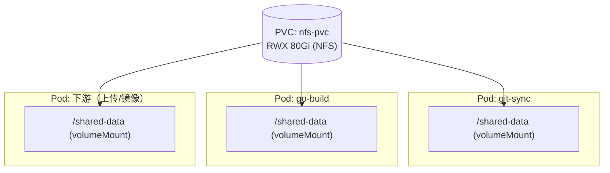
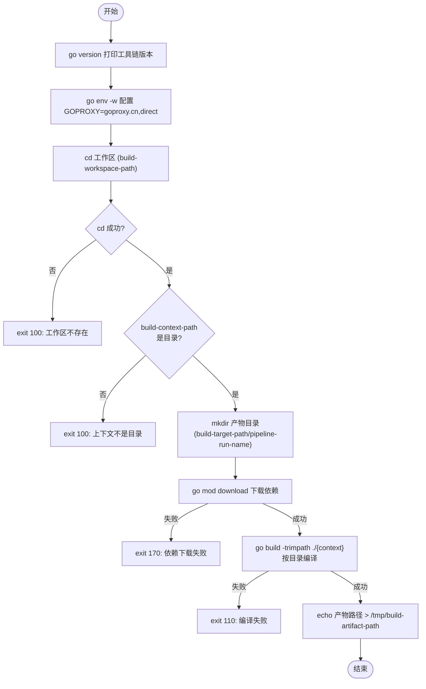

# go-build 技术设计

> 清单文件：[go-build.yaml](../../basetasktemplate/build/go-build.yaml)

---

## 一、背景与定位

`go-build` 是流水线中紧随 [git-sync](../代码/git-sync设计.md) 之后的**构建节点**。它在带 Go 工具链的容器里，把上游 `git-sync` 同步到 PVC 的 Go 源码**编译成静态二进制产物**，落到共享存储（PVC）上，同时把产物路径作为 output 暴露给下游（制品上传 / 镜像构建）。

它在整条流水线中处于「**源码已就绪 → 产出可部署制品**」的关键位置：

1. 读取上游 `git-sync` 写在共享 PVC 上的源码快照；
2. 配置模块代理、下载依赖；
3. 静态编译，产出可塞进 `scratch`/`distroless` 的二进制；
4. 把产物写到 PVC 的隔离目录，并将绝对路径通过 `outputs` 传递给下游。

运行环境：k8s v1.23.3 + Argo Workflows v3.4.8 + 基于 NFS 的共享 PVC。

---

## 二、设计目标

| 目标 | 说明 |
| --- | --- |
| **接口精简** | 只暴露必要入参，构建上下文、制品目录都有合理默认，关键项（镜像/工作区/制品名）之外零参即可用 |
| **静态编译默认开启** | 默认 `CGO_ENABLED=0`，产出完全静态链接的二进制，可跑在极简镜像里 |
| **可复现构建** | 默认 `-trimpath`，裁剪二进制里的源码绝对路径 |
| **依赖代理公网兜底** | `GOPROXY` 用 `goproxy.cn` + `direct`，不依赖私有制品代理，开箱即用 |
| **失败可定位** | 下载与编译分步，集中定义错误码，便于区分「依赖拉不下来」还是「代码编译不过」 |
| **自包含** | 不依赖外部 configMap，日志颜色内置，可独立运行 |

---

## 三、整体架构

所有构建相关 Pod 挂载**同一个 NFS PVC** 到 `/shared-data`，文件系统层面天然共享，无需显式传文件。`git-sync` 把源码 `rsync` 到 PVC 上的 workspace 子目录，`go-build` 读取该目录编译，产物写到 PVC 上的 target 子目录，下游 Pod 再从同一 PVC 读取。



**PVC 内与本节点相关的目录结构：**

```
/shared-data/
├── workspace/                         # 上游 git-sync 写入（本节点只读消费）
│   └── {pipeline-run-name}/git/       # rsync 后的源码快照（本节点的构建输入）
└── target/                            # 本节点写入（pv 中保存制品的根目录）
    └── {pipeline-run-name}/           # 用 pipeline-run-name 隔离，并发互不覆盖
        └── {build-artifact-name}      # 编译产物二进制
```

> PVC 的搭建（NFS Server、PV、PVC）见 [基于NFS的PV-PVC共享存储搭建.md](../存储/基于NFS的PV-PVC共享存储搭建.md)，对应清单 `pvc/nfs-pv.yaml`、`pvc/nfs-pvc.yaml`，PVC 名为 `nfs-pvc`。

---

## 四、运行前置条件（环境依赖）

| 依赖 | 说明 | 参考 |
| --- | --- | --- |
| k8s 集群 | v1.23.3 | [k8s搭建](../../环境搭建/k8s/v1.23.3.md) |
| Argo Workflows | v3.4.8，部署于 `argo` 命名空间 | [argo-workflows搭建](../../环境搭建/argo-workflows/v3.4.8.md) |
| 共享 PVC | `nfs-pvc`（RWX），挂载到 `/shared-data` | [NFS PV/PVC 搭建](../存储/基于NFS的PV-PVC共享存储搭建.md) |
| 上游 git-sync | 提供源码快照与 `build-workspace-path`、`build-artifact-name` 等出参 | [git-sync设计](../代码/git-sync设计.md) |
| 构建镜像 | 由入参 `build-go-image` 指定，自带 Go 工具链（如 `golang:1.22-alpine`） | 见 4.1 |

### 4.1 构建镜像

与 [git-sync](../代码/git-sync设计.md) 使用固定基础镜像不同，本节点的镜像**由入参 `build-go-image` 决定**——因为不同项目需要不同的 Go 版本。镜像只需满足一个前提：自带 `go` 工具链（官方 `golang:*` 镜像即可）。脚本中的 `go env`、`go mod download`、`go build` 都依赖它。

> 国内拉取 Docker Hub 镜像可能较慢，可通过镜像加速器拉取，或在 worker 上预加载镜像后把清单里的 `imagePullPolicy` 改为 `Never`。

---

## 五、入参设计（inputs）

| 参数名 | 默认值 | 必填 | 说明 |
| --- | --- | --- | --- |
| `pipeline-run-name` | `{{workflow.name}}` | 否 | 本次运行名称，构成产物输出子目录（并发隔离） |
| `build-workspace-path` | — | **是** | 工作区根目录（上游 git-sync 同步源码的路径），脚本 `cd` 进去构建 |
| `build-context-path` | `.` | 否 | 构建上下文路径，即 Go 主包目录（含 `main` 函数）相对工作区的位置，默认根目录 |
| `build-go-env` | `CGO_ENABLED=0` | 否 | 构建时的环境变量前缀，默认禁用 CGO 做静态链接；可改成带 `GOOS/GOARCH` 等 |
| `build-artifact-name` | — | **是** | 产物二进制文件名（通常来自上游 git-sync 的同名出参，无扩展名） |
| `build-go-image` | — | **是** | 构建容器镜像引用（自带 Go 工具链），如 `golang:1.22-alpine` |
| `build-target-path` | `/shared-data/target` | 否 | **pv 中保存制品的根目录**（挂在共享 PVC 上，每次 run 在其下建子目录隔离） |

> 三个必填项中，`build-workspace-path` 与 `build-artifact-name` 通常**直接取自上游 git-sync 的同名出参**，体现「上游算出来，下游直接用」的解耦；`build-go-image` 则由流水线/应用层显式指定。

---

## 六、出参设计（outputs）

只有一个，通过写入 `/tmp/` 临时文件再由 `valueFrom` 读取（script 模板标准做法）。

| 参数名 | 示例值 | 下游用途 |
| --- | --- | --- |
| `build-artifact-path` | `/shared-data/target/wf-xxx/20240626...main.a1b2c3d` | 产物二进制绝对路径，传给 artifact-upload（归档）、buildkit-build（打镜像） |

> 这是 go-build 与下游**唯一的衔接物**：下游靠这个路径去共享 PVC 上把二进制取走。这是 Argo 流水线的典型实践——**小元数据走 parameters，大产物走 PVC**，避免把二进制塞进参数。

---

## 七、核心流程



---

## 八、关键设计决策

### 8.1 静态编译默认开启（CGO_ENABLED=0）

默认 `build-go-env=CGO_ENABLED=0`，禁用 CGO，标准库（如 `net`、`os/user`）全部用纯 Go 实现，产出**完全静态链接**的二进制。优点是可跑在 `scratch`/`distroless` 等极简镜像里，无 glibc 依赖、体积小、安全面小。这是云原生容器场景的合理默认。需要 cgo 库（如 `sqlite3`）时可改 `build-go-env`。

### 8.2 在模块根用 `go build` 编译上下文目录（规整 ./ 前缀）

脚本始终停留在工作区（模块根）执行 `go mod download` 与 `go build`，把 `build-context-path` 传给 `go build`。这是关键正确性设计：

- `go build <path>` 对**不带 `./`、`../`、`/` 前缀**的参数会当作 **import path** 解析，而非文件系统目录；
- `cmd/server` 这种裸路径，因 `cmd` 恰好是 GOROOT 下的目录（`/usr/local/go/src/cmd`），Go 会去那里找，报 `package cmd/server is not in std`，根本不会查你的模块；
- 因此对裸相对路径补 `./` 前缀强制按目录解析；入参已是目录形式则保持原样。

为兼容多种入参写法，传入 `go build` 前先做一次规整：

```sh
ctx="{{inputs.parameters.build-context-path}}"
case "$ctx" in .*|/*) : ;; *) ctx="./$ctx" ;; esac
```

| 入参 | 规整后 | 说明 |
| --- | --- | --- |
| `.` | `.` | 默认，当前目录，原样保留 |
| `./cmd/server`、`../pkg`、`/abs` | 不变 | 已是目录形式 |
| `cmd/server` | `./cmd/server` | 补 `./`，避免被当 import path |

保持在工作区（模块根）执行而非 cd 进主包目录，`go mod download` 与 `go build` 同处一个 cwd，行为直观、贴近项目根视角。

### 8.3 -trimpath（可复现构建 + 安全）

Go 默认会把编译机的源码绝对路径写进二进制（用于 panic 栈回溯）。`-trimpath` 把这些路径替换为 `module@version/包路径` 形式，带来两个好处：

1. **可复现构建**：不同机器上同样源码产出 bit-for-bit 一致的二进制；
2. **安全**：不泄露构建机目录结构（CI 路径常含用户名、内部目录等敏感信息）。

### 8.4 GOPROXY 只用公网代理

脚本里 `go env -w GOPROXY=https://goproxy.cn,direct`：`goproxy.cn` 作主代理，`direct` 兜底直连 VCS。**不依赖任何私有制品代理**，开箱即用，适合内网无私有 Go 代理的环境。`go env -w` 把配置写入容器内 `GOENV` 文件，对本次脚本生效。

> 若将来引入私有 module（公司域名），建议补 `go env -w GOPRIVATE=*.your-domain`，避免私有仓库路径被查询公网 sumdb。

### 8.5 暂不缓存依赖（不挂 /go/pkg/mod）

当前版本**不挂载 `/go/pkg/mod`**，每次构建都重新 `go mod download`。取舍是：实现最简、不存在缓存膨胀与跨 run 缓存污染问题；代价是重复下载耗时。缓存复用作为后续演进项（见第十一节）。

### 8.6 下载与编译分步

把 `go mod download` 和 `go build` 拆成两步并分别捕获失败。这样构建失败时，**错误码能明确区分**是「依赖拉不下来」（170，外部依赖问题）还是「代码编译不过」（110，代码问题），便于上游排障定位。

### 8.7 错误码集中定义

把退出码集中为脚本头部的 `readonly` 常量，便于上游区分错误类型：

| 退出码 | 常量 | 含义 |
| --- | --- | --- |
| 100 | `EXIT_USER_ERROR` | 用户参数/配置错误（工作区/上下文目录不存在、未找到 go.mod 等） |
| 110 | `EXIT_BUILD_ERROR` | 编译失败（代码问题） |
| 170 | `EXIT_EXTERNAL_ERROR` | 外部依赖错误（依赖下载失败：GOPROXY/网络） |

> 100（用户错误）与 170（外部依赖错误）的语义与 [git-sync](../代码/git-sync设计.md) 保持一致，便于整条流水线统一识别错误大类。

### 8.8 并发隔离（产物路径含 pipeline-run-name）

产物路径为 `build-target-path/pipeline-run-name/build-artifact-name`，用 `pipeline-run-name`（默认 `{{workflow.name}}`，每次运行唯一）做前缀。同一应用并发构建时，各 run 产物落在独立子目录，互不覆盖。

### 8.9 build-go-env 作为环境变量前缀

`build-go-env` 直接拼在 `go build` 命令**前**当环境变量前缀展开（默认展开为 `CGO_ENABLED=0 go build ...`）。这种用法简洁，但只适合传**环境变量**（如 `GOOS`、`GOARCH`、`CGO_ENABLED`）。若要传 `-ldflags` 等编译参数，不能塞进 `build-go-env`（会被当成命令），需后续扩展为独立参数。

---

## 九、资源与调度

```yaml
activeDeadlineSeconds: 3600      # 单次最多 1 小时
nodeSelector:
  kubernetes.io/os: linux
resources:
  requests: { cpu: "0.5", memory: "512Mi" }
  limits:   { cpu: "2",   memory: "2Gi" }
```

Go 编译是 **CPU 密集型**任务，limit 给到 2 核以兼顾中大项目编译速度；`go mod download` 是网络密集型，受 GOPROXY 与出口带宽影响。单次上限 1 小时，防止卡死占用流水线。

---

## 十、清单文件与使用方式

### 10.1 清单文件

完整清单见 [go-build.yaml](../../basetasktemplate/build/go-build.yaml)（本文不重复贴 YAML，以清单为准，保持单一事实来源）。

### 10.2 前置资源

```shell
# 1. NFS PV/PVC（见存储搭建文档）
kubectl apply -f pvc/nfs-pv.yaml
kubectl apply -f pvc/nfs-pvc.yaml

# 2. 上游 git-sync 模板（提供 build-workspace-path、build-artifact-name 等出参）
kubectl apply -f basetasktemplate/code/git-sync.yaml -n argo

# 3. 构建镜像（如 golang:1.22-alpine，拉取或预加载）

# 4. 部署本模板
kubectl apply -f basetasktemplate/build/go-build.yaml -n argo
```

### 10.3 在父 Workflow 中调用

> 注意：通过 `templateRef` 调用时，Argo **不会**带入本模板 `spec.volumes` 里声明的卷，父 Workflow 必须在自身 `spec.volumes` 中声明同名的 `shared-data`（PVC `nfs-pvc`）。

```yaml
apiVersion: argoproj.io/v1alpha1
kind: Workflow
metadata:
  generateName: my-pipeline-
spec:
  entrypoint: main
  volumes:
    - name: shared-data
      persistentVolumeClaim:
        claimName: nfs-pvc
  templates:
    - name: main
      tasks:
        - name: sync
          templateRef:
            name: git-sync
            template: entrypoint
          arguments:
            parameters:
              - name: app-name
                value: my-app
              - name: git-url
                value: git@gitee.com:xxx/my-app.git
              - name: git-branch
                value: main
        - name: build
          depends: sync
          templateRef:
            name: go-build
            template: entrypoint
          arguments:
            parameters:
              - name: build-workspace-path
                value: "{{tasks.sync.outputs.parameters.build-workspace-path}}"
              - name: build-artifact-name
                value: "{{tasks.sync.outputs.parameters.build-artifact-name}}"
              - name: build-go-image
                value: golang:1.22-alpine
              - name: pipeline-run-name
                value: "{{workflow.name}}"
```

下游节点用 `{{tasks.build.outputs.parameters.build-artifact-path}}` 引用产物路径。

---

## 十一、后续演进（TODO）

| 项 | 说明 |
| --- | --- |
| 依赖缓存 | 挂载 PVC 子路径到 `/go/pkg/mod`（GOMODCACHE），跨构建复用 module，大幅减少重复下载；需配套定期清理避免膨胀 |
| 构建缓存 | 挂载 `/root/.cache/go-build`（GOCACHE）到 PVC，增量编译提速 |
| 缩体积 | `go build` 加 `-ldflags "-s -w"` 去符号表/调试信息（需改造为独立参数，见 8.8） |
| 产物校验 | 编译后 `sha256sum` 写入 output，供下游校验完整性 |
| 私有模块 | 引入私有 module 时补 `GOPRIVATE`，避免私有仓库路径泄漏到公网 sumdb |
| 固定工具链 | `go env -w GOTOOLCHAIN=local`，避免 `go.mod` 中 `go 1.x` 触发自动下载新工具链导致构建不确定 |

---

## 十二、参考资料

- [git-sync设计.md](../代码/git-sync设计.md) — 上游源码同步节点
- [基于NFS的PV-PVC共享存储搭建.md](../存储/基于NFS的PV-PVC共享存储搭建.md) — 共享 PVC 搭建
- [argo-workflows搭建](../../环境搭建/argo-workflows/v3.4.8.md)
- [k8s搭建](../../环境搭建/k8s/v1.23.3.md)
- 清单文件：[go-build.yaml](../../basetasktemplate/build/go-build.yaml)
