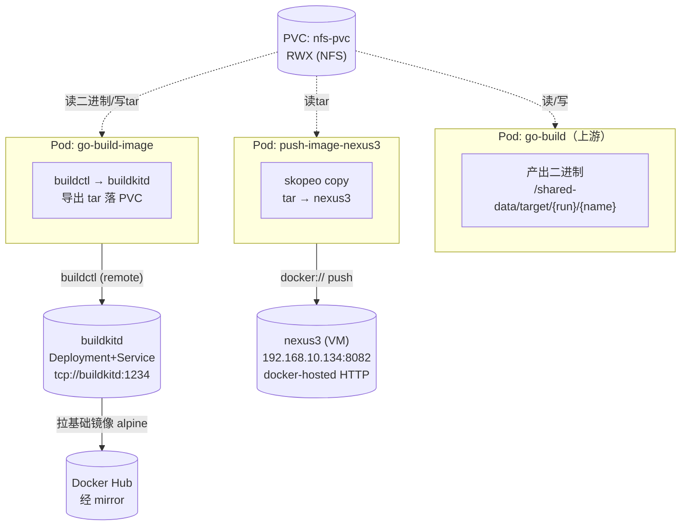
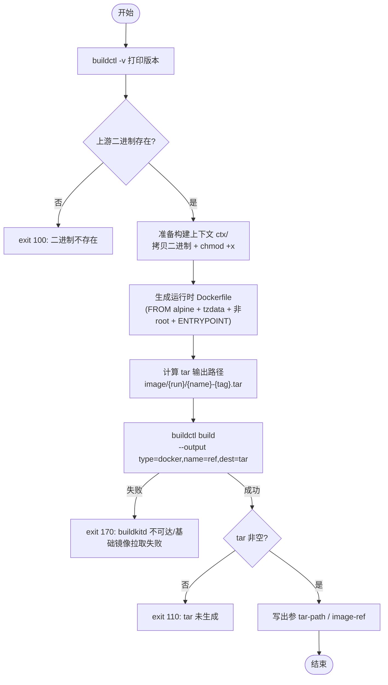
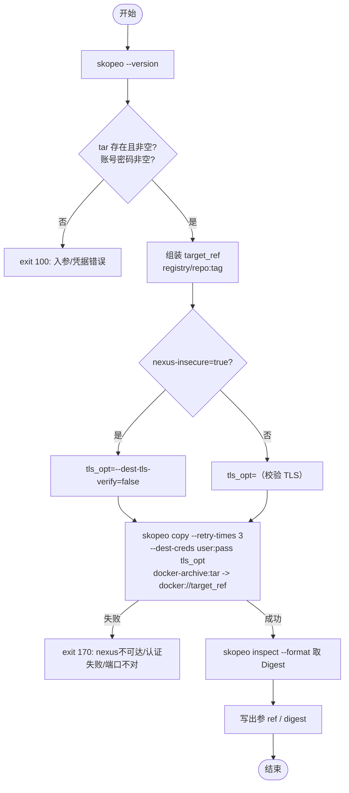

# 镜像构建与推送技术设计（go-build-image + push-image-nexus3）

> 清单文件：
> - [go-build-image.yaml](../../basetasktemplate/build/go-build-image.yaml) —— 把 Go 二进制打包成镜像，导出 tar 落到 PVC
> - [push-image-nexus3.yaml](../../basetasktemplate/nexus3/push-image-nexus3.yaml) —— 把 PVC 上的镜像 tar 推送到 nexus3

---

## 一、背景与定位

在 [go-build](./go-build设计.md) 把 Go 源码编译成静态二进制之后，要把这个二进制**包装成可运行的 Docker 镜像**，再**推送到制品仓库 nexus3**，才算完成「源码 → 可部署镜像制品」的闭环。本文设计的就是这条链路上的最后两段：

| 节点 | 职责 | 输入 | 输出 |
| --- | --- | --- | --- |
| **go-build-image** | 用 buildctl 把**已编译好的二进制**包装成最小运行镜像，导出为 docker tar 落到 PVC | 二进制路径（go-build 出参） | 镜像 tar 路径 |
| **push-image-nexus3** | 用 skopeo 把 PVC 上的镜像 tar 推送到 nexus3 docker-hosted 仓库 | 镜像 tar 路径 | nexus3 镜像 ref + digest |

> ⚠️ go-build-image **只做「打包装镜像」，不重新编译**。编译由上游 go-build 完成；镜像构建与仓库推送被拆成两个独立节点，原因见 [§七](#七关键设计决策跨两节点)。

运行环境：k8s v1.23.3 + Argo Workflows v3.4.8 + 基于 NFS 的共享 PVC + 集群内 buildkitd + 虚拟机上的 nexus3（`192.168.10.134:8082`）。

---

## 二、设计目标

| 目标 | 说明 |
| --- | --- |
| **职责单一、可复用** | 「打包镜像」与「推送仓库」拆成两个独立节点，各自单一职责；push 节点与语言无关，任何落到 PVC 的镜像 tar 都能推 |
| **解耦编译与打包** | go-build-image 复用上游二进制，不在镜像构建里重复 go build，避免工具链/参数双重维护 |
| **构建落盘、推送可重试** | 镜像先导成 tar 落 PVC，推送独立成步——推送失败可单独重跑，不必重新构建镜像 |
| **最小运行镜像** | 运行时基于 alpine，非 root 运行，带 tzdata/ca-certificates，体积小、安全面小 |
| **静态二进制假设显式化** | 默认 alpine 基镜前提是上游 `CGO_ENABLED=0` 静态链接（go-build 默认即如此），并在文档/注释中点明 |
| **HTTP 仓库友好** | nexus3 docker-hosted 学习环境为 HTTP（8082），通过 `--dest-tls-verify=false` 支持，且可参数化切换 HTTPS |
| **凭据走 Secret** | nexus3 账号密码用 k8s Secret 注入，不硬编码进清单 |
| **失败可定位** | 集中错误码，语义与 go-build / git-sync 保持一致 |

---

## 三、整体架构

三个节点（go-build → go-build-image → push-image-nexus3）挂载**同一个 NFS PVC** 到 `/shared-data`，大产物（二进制、镜像 tar）在 PVC 上以文件形式流转，节点之间只传**小元数据（路径）**。go-build-image 还依赖集群内的 **buildkitd**（构建引擎，拉取基础镜像 + 打镜像），push 节点依赖虚拟机上的 **nexus3**（接收镜像）。



**PVC 内目录结构（与本链路相关）：**

```
/shared-data/
├── target/                              # go-build 写入（二进制）—— go-build-image 读取
│   └── {pipeline-run-name}/
│       └── {build-artifact-name}        # 静态二进制
└── image/                               # go-build-image 写入（镜像 tar）—— push 节点读取
    └── {pipeline-run-name}/
        ├── ctx/                         # 构建上下文：二进制副本 + 自动生成的 Dockerfile
        └── {image-name}-{image-tag}.tar # docker 格式镜像 tar（buildctl type=docker 产物）
```

> 各节点都用 `pipeline-run-name`（默认 `{{workflow.name}}`，每次运行唯一）做子目录隔离，**并发构建互不覆盖**。

---

## 四、运行前置条件（环境依赖）

| 依赖 | 说明 | 参考 |
| --- | --- | --- |
| 共享 PVC | `nfs-pvc`（RWX），挂载到 `/shared-data` | [NFS PV/PVC 搭建](../存储/基于NFS的PV-PVC共享存储搭建.md) |
| 上游 go-build | 提供二进制绝对路径出参 `build-artifact-path` | [go-build设计](./go-build设计.md) |
| **buildkitd** | 集群内 `Deployment` + `Service`（名 `buildkitd`，端口 `1234`）；go-build-image 用 `buildctl` 直连它（remote 模式）。清单见 [buildkitd.yaml](../../basetasktemplate/tools/buildkitd.yaml) | 见 4.1 |
| **基础镜像源** | buildkitd 从本地 nexus3 拉取基础镜像（不依赖外网 Docker Hub）；`buildkitd.toml` 已声明 nexus3 为 HTTP 仓库 | 见 4.2 |
| **nexus3 docker-hosted** | 虚拟机 nexus3 上已建 `docker-hosted` 仓库（HTTP 8082），账号可用 | [nexus3搭建](../../环境搭建/制品仓库/nexus3搭建.md) |
| **nexus3 凭据 Secret** | `nexus-credentials`（含 `username`/`password` 两个 key） | 见 4.3 |
| 集群→nexus3 网络 | argo Pod 能访问 `192.168.10.134:8082`（同网段即可） | — |
| 客户端镜像 | go-build-image 用 `moby/buildkit:v0.31.1`（含 buildctl）；push 节点用 `quay.io/skopeo/stable:v1.19.0` | 国内建议预加载 |

### 4.1 buildkitd（构建引擎）

go-build-image 的 Pod 只运行 **buildctl 客户端**（在 `moby/buildkit` 镜像里），真正的构建（拉基础镜像、执行 Dockerfile、导出层）由集群内独立的 **buildkitd** 完成。buildctl 通过 `--addr tcp://buildkitd:1234` 连过去（remote 模式）。

> 关键：buildctl 处于 remote 模式时，读取的是**本 Pod 的本地文件系统（PVC）**并把构建上下文流式发给 buildkitd，故 **buildkitd 不需要挂 PVC**；本 Pod 负责读二进制、写 tar。

### 4.2 基础镜像走本地 nexus3（推荐：完全不走外网）

**问题**：buildkitd 默认从 Docker Hub 拉取 `FROM` 指定的基础镜像（如 `alpine:3.22`），国内直连普遍超时，卡在 `load metadata` 失败。

**本环境的解法**：把基础镜像**预先转储到本地 nexus3**，让 buildkitd 从 nexus3 拉取，彻底不依赖外网 Docker Hub。需要**三步配合**：

**① 预先把基础镜像推到 nexus3 docker-hosted**（一次性，在能访问外网的机器上）：

```bash
# 8082 为 nexus3 docker-hosted 的 HTTP 端口
docker pull alpine:3.22
docker tag  alpine:3.22 192.168.10.134:8082/alpine:3.22
docker push 192.168.10.134:8082/alpine:3.22
```

> `alpine:3.22` 已按此方式存入 nexus3（见 [nexus3搭建](../../环境搭建/制品仓库/nexus3搭建.md) §docker-hosted 上传）。其它基础镜像同理。

**② Dockerfile 的 FROM 指向 nexus3 镜像**：go-build-image 的 `build-runtime-base-image` 入参默认即 `192.168.10.134:8082/alpine:3.22`，生成的 Dockerfile `FROM` 会直接引用它。

**③ buildkitd 必须声明该 registry 走 HTTP**（关键、最易遗漏）：nexus3 docker-hosted 是**纯 HTTP**，buildkitd 默认按 HTTPS 拉取会失败（TLS/连接错误）。必须在 buildkitd 的 `buildkitd.toml` 里把该 host 标记为 HTTP：

```toml
# /etc/buildkit/buildkitd.toml
[registry."192.168.10.134:8082"]
  http = true          # 纯 HTTP 仓库
  # 注意：insecure=true 是给「HTTPS + 自签证书」用的，与 http 互斥（官方明确不可同时开），这里不要设。
```

> 这一步已**内置**在本仓库的 [buildkitd.yaml](../../basetasktemplate/tools/buildkitd.yaml) 的 ConfigMap 里。
>
> ⚠️ **光把镜像写成 `192.168.10.134:8082/alpine:3.22`（②）是不够的**，必须同时让 buildkitd 知道该 registry 走 HTTP（③），两者缺一不可。只有②没有③，buildkitd 会尝试 HTTPS 而失败。
>
> 另需确保 nexus3 开启了**匿名拉取**（初始化向导 Enable anonymous access），否则 buildkitd 拉取需额外配认证。
>
> **备选方案**（不改 Dockerfile 的 FROM）：也可在 buildkitd.toml 用 `[registry."docker.io"] mirrors = ["192.168.10.134:8082"]` 透明镜像 docker.io，Dockerfile 继续写 `FROM alpine:3.22`——但镜像在 nexus3 中需带 `library/` 前缀（即 `library/alpine:3.22`），不如直接引用清爽，故本设计采用「直接引用 nexus3 镜像」方案。

### 4.3 nexus3 凭据 Secret

nexus3 账号密码用 k8s Secret 注入（push-image-nexus3 通过 `secretKeyRef` 读取为 `NEXUS_USERNAME`/`NEXUS_PASSWORD`），不写进流水线清单。本仓库已提供 Secret 清单 [secrets/nexus-credentials.yaml](../../secrets/nexus-credentials.yaml)：

```shell
kubectl apply -f secrets/nexus-credentials.yaml -n argo
# 等价于：
# kubectl -n argo create secret generic nexus-credentials \
#   --from-literal=username=admin --from-literal=password=admin
```

> 学习环境用了 nexus3 初始化的 `admin/admin`（见 [nexus3搭建](../../环境搭建/制品仓库/nexus3搭建.md)）。**生产建议**：① 为制品上传单独建账号（勿用高权限的 admin）；② 用 SealedSecrets / External Secrets / SOPS 加密管理，勿把明文密码提交进 git（清单里的 stringData 仅适合学习仓库）。

---

## 五、go-build-image 设计

### 5.1 入参（inputs）

| 参数名 | 默认值 | 必填 | 说明 |
| --- | --- | --- | --- |
| `pipeline-run-name` | `{{workflow.name}}` | 否 | 本次运行名称，构成产物输出子目录（并发隔离） |
| `build-artifact-path` | — | **是** | 上游 go-build 输出的二进制绝对路径（在 PVC 上），如 `/shared-data/target/{run}/go-web-demo` |
| `build-artifact-name` | `go-web-demo` | 否 | 二进制在镜像内的目标文件名（即 ENTRYPOINT 执行名），通常取自上游同名出参 |
| `build-image-name` | `go-web-demo` | 否 | 目标镜像名（repo 名） |
| `build-image-tag` | `latest` | 否 | 目标镜像 tag |
| `build-image-target-path` | `/shared-data/image` | 否 | PVC 中保存镜像 tar 的根目录 |
| `build-runtime-base-image` | `192.168.10.134:8082/alpine:3.22` | 否 | 运行时基础镜像（最终镜像 FROM），默认走本地 nexus3（需先预推，见 4.2）；要求上游二进制静态链接 |
| `build-app-port` | `9000` | 否 | 应用监听端口，仅写入 EXPOSE 做文档化 |
| `buildkit-addr` | `tcp://buildkitd:1234` | 否 | buildkitd 远程地址（remote 模式） |
| `buildkit-image` | `moby/buildkit:v0.31.1` | 否 | buildctl 客户端镜像 |

> `build-artifact-path` 是与上游 go-build **唯一的衔接物**（直接取 `{{tasks.build.outputs.parameters.build-artifact-path}}`），体现「小元数据走 parameters，大产物走 PVC」的解耦。

### 5.2 出参（outputs）

| 参数名 | 示例值 | 下游用途 |
| --- | --- | --- |
| `build-image-tar-path` | `/shared-data/image/{run}/go-web-demo-latest.tar` | 镜像 tar 绝对路径，传给 push-image-nexus3 |
| `build-image-ref` | `go-web-demo:latest` | tar 内部的镜像 ref，便于下游命名/记录 |

### 5.3 核心流程



### 5.4 自动生成的 Dockerfile

go-build-image **不要求项目自带 Dockerfile**，而是按入参当场生成一个最小运行时 Dockerfile（二进制已编译好，无需多阶段 builder）：

```dockerfile
FROM 192.168.10.134:8082/alpine:3.22
RUN apk add --no-cache tzdata ca-certificates && \
    cp /usr/share/zoneinfo/Asia/Shanghai /etc/localtime && \
    echo "Asia/Shanghai" > /etc/timezone
RUN addgroup -S app && adduser -S -G app app
WORKDIR /app
COPY go-web-demo /app/go-web-demo
USER app
EXPOSE 9000
ENTRYPOINT ["/app/go-web-demo"]
```

要点：① `tzdata + ca-certificates` 保证容器内日志时区正确、出站 HTTPS 可校验；② 非 root 运行（端口 >1024 无需特权）；③ 不重新编译，只 COPY 已有二进制。

### 5.5 关键决策

- **只打包不编译**：复用上游 go-build 产物，避免在镜像构建里再维护一份 go 工具链/编译参数。
- **静态二进制假设**：默认 `alpine` 基镜要求上游 `CGO_ENABLED=0`（go-build 默认即如此）。若上游改 `CGO_ENABLED=1`，需把 `build-runtime-base-image` 换成带 glibc 的镜像（如 `debian:stable-slim`），否则二进制跑不起来。
- **tar 中转（type=docker）**：`--output type=docker,name=ref,dest=tar` 导出 docker 格式 tar。docker 格式是「既能 `docker load`、又能被 skopeo 以 `docker-archive:` 读取」的通用格式，给下游最大灵活性。
- **构建上下文最小化**：单独建 `ctx/` 目录，只放「二进制副本 + Dockerfile」，避免把 PVC 上其它产物扫进构建上下文。

---

## 六、push-image-nexus3 设计

### 6.1 入参（inputs）

| 参数名 | 默认值 | 必填 | 说明 |
| --- | --- | --- | --- |
| `build-image-tar-path` | — | **是** | 待推送的镜像 tar 绝对路径（PVC 上），取自上游 go-build-image 出参 |
| `nexus-docker-registry` | `192.168.10.134:8082` | 否 | nexus3 docker-hosted 仓库地址（host:port），学习环境为 HTTP |
| `nexus-repo-name` | `go-web-demo` | 否 | 仓库内镜像名（repo path），最终 ref = `registry/repo:tag` |
| `nexus-image-tag` | `latest` | 否 | 推送目标 tag |
| `nexus-insecure` | `true` | 否 | 是否跳过 TLS 校验；HTTP 仓库必须 `true`，HTTPS 设 `false` |
| `nexus-credential-secret` | `nexus-credentials` | 否 | 存放账号密码的 Secret 名（含 `username`/`password`） |
| `skopeo-image` | `quay.io/skopeo/stable:v1.19.0` | 否 | skopeo 客户端镜像（需提供 `sh` 与 `skopeo`） |

> 凭据（`NEXUS_USERNAME`/`NEXUS_PASSWORD`）通过 `secretKeyRef` 从 Secret 注入为环境变量，**不作为入参暴露**。

### 6.2 出参（outputs）

| 参数名 | 示例值 | 说明 |
| --- | --- | --- |
| `nexus-image-ref` | `192.168.10.134:8082/go-web-demo:latest` | 推送后的完整镜像 ref，可供部署节点直接拉取 |
| `nexus-image-digest` | `sha256:ba5e23...499f` | 镜像 digest，供下游校验完整性（查询失败则为 `unknown`） |

### 6.3 核心流程



### 6.4 推送命令

核心是一条 `skopeo copy`：把 docker 格式 tar 拷到 nexus3 的 registry：

```sh
skopeo copy --retry-times 3 \
    --dest-creds "${NEXUS_USERNAME}:${NEXUS_PASSWORD}" \
    --dest-tls-verify=false \
    "docker-archive:/shared-data/image/{run}/go-web-demo-latest.tar" \
    "docker://192.168.10.134:8082/go-web-demo:latest"
```

- `docker-archive:` —— 直接读 buildctl 导出的 docker 格式 tar，无需 `docker load`；
- `--dest-creds` —— 账号密码（来自 Secret 注入的环境变量）；
- `--dest-tls-verify=false` —— nexus3 docker-hosted 学习环境是 HTTP（8082），必须关闭目的端 TLS 校验；
- 推送时按 `target_ref` **重命名**，与 tar 内部原 ref 无关。

### 6.5 关键决策

- **与语言无关、可复用**：push 节点只认「PVC 上的镜像 tar」，不关心它是 Go / Java / 静态前端打出来的。任何上游产出 docker tar 都能复用本节点推送。
- **skopeo 而非 docker load+push**：见 [§七](#七关键设计决策跨两节点)。
- **HTTP 仓库参数化**：`nexus-insecure` 默认 `true` 适配学习环境的 HTTP 8082；将来 nexus 启用 HTTPS，改 `false` 即走正常 TLS 校验，无需改清单。
- **重试**：`--retry-times 3` 对网络抖动友好。
- **digest 可选**：推送成功后用 `skopeo inspect --format '{{.Digest}}'` 取 digest；查询失败（`2>/dev/null || true`）不阻断流程，digest 记为 `unknown`。

---

## 七、关键设计决策（跨两节点）

### 7.1 为什么把「打包镜像」和「推送仓库」分成两个节点？

把镜像构建（打 tar 落 PVC）与推送（上传 nexus3）拆成两个独立节点，而不是塞进一个脚本，原因：

- **职责单一**：构建只管「二进制→镜像」，推送只管「tar→仓库」，各自逻辑清晰、可独立测试。
- **失败可独立重试**：镜像一旦打成 tar 落到 PVC，推送失败（网络抖动、仓库临时不可用）只需重跑 push 节点，不必重新构建镜像。
- **推送节点语言无关、可复用**：push 节点只认「PVC 上的镜像 tar」，不关心它是 Go / Java / 静态前端打出来的——任何上游产出 docker tar 都能复用本节点。
- **仓库可替换**：换仓库（换 nexus 地址、甚至换 harbor）只改 push 节点入参，不动构建逻辑。
- **解耦编译与打包**：go-build-image 只复用上游 go-build 的二进制，不在镜像构建里重复 go build，避免工具链/参数双重维护。

**取舍**：换取「职责单一、可复用、可独立重试」，代价是链路多一个节点、PVC 多存一份 tar。对学习环境与「聚焦 Go 镜像制品」的目标，这是更清晰的取舍。

### 7.2 为什么用 skopeo 推送（而非 docker load + docker push）？

nexus3 搭建文档里推送用的是 `docker login` + `docker tag` + `docker push`，那依赖一个 **docker daemon**。但在 k8s Pod 里跑 docker daemon 要么 DinD（特权、重），要么挂宿主 docker.sock（不安全、跨节点不一致）。**skopeo 是 daemonless 的**：

- 直接 `docker-archive:tar → docker://registry`，**无需 docker daemon**；
- `--dest-tls-verify=false` 一键支持 HTTP 仓库（docker CLI 配 insecure registry 更繁琐）；
- `--dest-creds` 内联认证，无需 `docker login` 写凭证文件；
- 天然适合 CI/容器场景，轻量、无特权。

> 镜像 tar 是 buildctl 的 `type=docker` 产物，**既能被 `docker load` 也能被 skopeo 的 `docker-archive:` 读取**，所以本机调试时仍可 `docker load < x.tar` 验证。

### 7.3 为什么 tar 用 docker 格式（而非 oci）？

docker 格式（带 `manifest.json`/`Repositories`）是兼容性最广的镜像归档：`docker load`、`skopeo docker-archive:`、`crane` 都认。OCI 格式（`oci:`）部分老版本 docker load 不支持。go-web-demo 实战文档里 `type=docker` + `docker load` 已端到端验证可用，故沿用。

---

## 八、资源与调度

```yaml
# go-build-image：Pod 只跑 buildctl（轻），重活在 buildkitd
activeDeadlineSeconds: 1800
resources:
  requests: { cpu: "0.5", memory: "512Mi" }
  limits:   { cpu: "1",   memory: "1Gi" }

# push-image-nexus3：读 tar + 网络上传
activeDeadlineSeconds: 900
resources:
  requests: { cpu: "0.2", memory: "256Mi" }
  limits:   { cpu: "0.5", memory: "512Mi" }
```

镜像构建的 CPU/IO 密集部分发生在 **buildkitd**（不在 go-build-image 的 Pod），故该 Pod 给得不大；push 节点主要是网络上传，资源需求最小。两者都设 `nodeSelector: kubernetes.io/os: linux`。

---

## 九、清单文件与使用方式

### 9.1 清单文件

- [go-build-image.yaml](../../basetasktemplate/build/go-build-image.yaml) —— Go 二进制打包成镜像
- [push-image-nexus3.yaml](../../basetasktemplate/nexus3/push-image-nexus3.yaml) —— 镜像 tar 推送 nexus3
- [buildkitd.yaml](../../basetasktemplate/tools/buildkitd.yaml) —— buildkitd 引擎部署（含 nexus3 HTTP 仓库配置）
- [nexus-credentials.yaml](../../secrets/nexus-credentials.yaml) —— nexus3 账号密码 Secret

> 本文不重复贴完整 YAML，以清单为单一事实来源。

### 9.2 前置资源

```shell
# 1. NFS PV/PVC（见存储搭建文档）
kubectl apply -f pvc/nfs-pv.yaml
kubectl apply -f pvc/nfs-pvc.yaml

# 2. 上游模板：git-sync、go-build
kubectl apply -f basetasktemplate/code/git-sync.yaml -n argo
kubectl apply -f basetasktemplate/build/go-build.yaml -n argo

# 3. buildkitd（Deployment + Service buildkitd:1234，已内置 nexus3 HTTP 仓库配置，见 4.2）
kubectl apply -f basetasktemplate/tools/buildkitd.yaml -n argo

# 4. nexus3 凭据 Secret（见 4.3）
kubectl apply -f secrets/nexus-credentials.yaml -n argo

# 5. 把基础镜像预推到 nexus3（一次性，见 4.2），如 alpine:3.22

# 6. 客户端镜像预加载（可选，国内拉取慢时）
#    moby/buildkit:v0.31.1、quay.io/skopeo/stable:v1.19.0

# 7. 部署本两模板
kubectl apply -f basetasktemplate/build/go-build-image.yaml -n argo
kubectl apply -f basetasktemplate/nexus3/push-image-nexus3.yaml -n argo
```

### 9.3 端到端串联（父 Workflow 示例）

> 注意：通过 `templateRef` 调用时，Argo **不会**带入各模板 `spec.volumes` 里声明的卷，父 Workflow 必须在自身 `spec.volumes` 中声明同名的 `shared-data`（PVC `nfs-pvc`）。

```yaml
apiVersion: argoproj.io/v1alpha1
kind: Workflow
metadata:
  generateName: go-image-pipeline-
spec:
  entrypoint: main
  serviceAccountName: argo
  volumes:
    - name: shared-data
      persistentVolumeClaim:
        claimName: nfs-pvc
  templates:
    - name: main
      dag:
        tasks:
          # ① 同步源码（略，参数按 git-sync 文档）
          - name: sync
            templateRef: { name: git-sync, template: entrypoint }
            arguments:
              parameters:
                - { name: app-name, value: go-web-demo }
                - { name: git-url, value: "git@gitee.com:awsomeyangtu/go-web-demo.git" }
                - { name: git-branch, value: main }

          # ② 编译二进制
          - name: build
            depends: sync
            templateRef: { name: go-build, template: entrypoint }
            arguments:
              parameters:
                - name: build-workspace-path
                  value: "{{tasks.sync.outputs.parameters.build-workspace-path}}"
                - name: build-artifact-name
                  value: "{{tasks.sync.outputs.parameters.build-artifact-name}}"
                - { name: build-go-image, value: "golang:1.26.4-alpine" }
                - { name: pipeline-run-name, value: "{{workflow.name}}" }

          # ③ 打包镜像 -> tar 落 PVC
          - name: image
            depends: build
            templateRef: { name: go-build-image, template: entrypoint }
            arguments:
              parameters:
                - name: build-artifact-path
                  value: "{{tasks.build.outputs.parameters.build-artifact-path}}"
                - { name: build-artifact-name, value: "{{tasks.sync.outputs.parameters.build-artifact-name}}" }
                - { name: build-image-name, value: go-web-demo }
                - { name: build-image-tag, value: "1.0" }
                - { name: pipeline-run-name, value: "{{workflow.name}}" }

          # ④ 推送 nexus3
          - name: push
            depends: image
            templateRef: { name: push-image-nexus3, template: entrypoint }
            arguments:
              parameters:
                - name: build-image-tar-path
                  value: "{{tasks.image.outputs.parameters.build-image-tar-path}}"
                - { name: nexus-repo-name, value: go-web-demo }
                - { name: nexus-image-tag, value: "1.0" }
```

运行后，最终镜像为 `192.168.10.134:8082/go-web-demo:1.0`，可用 `docker pull` 拉取（见 [nexus3搭建](../../环境搭建/制品仓库/nexus3搭建.md) §docker-hosted 拉取）。

---

## 十、后续演进（TODO）

| 项 | 说明 |
| --- | --- |
| buildkit 构建缓存 | 给 buildctl 加 `--import-cache/--export-cache type=local`，跨构建复用层（需给 buildkitd 挂缓存卷） |
| 镜像签名/扫描 | push 后接入 cosign 签名、trivy 扫描，digest 已具备可作锚点 |
| 推送多架构镜像 | buildctl 改 `--opt platform=linux/amd64,linux/amd64` + `--output type=image,push=true` 直推（docker tar 不支持 manifest list，多架构需绕开 tar 中转） |
| 私有仓库 HTTPS | nexus3 启用 HTTPS 后，把 `nexus-insecure` 设 `false` 并配置 CA |
| 凭据更安全 | skopeo 改用 `--dest-authfile` + 预生成 auth 文件，避免密码出现在进程参数 |
| 制品元数据回调 | 把 ref/digest 上报流水线平台（制品元数据回调），与部署节点衔接 |
| Dockerfile 可定制 | go-build-image 增加入参允许传入自定义 Dockerfile 内容（覆盖自动生成的） |

---

## 十一、参考资料

- [go-build设计.md](./go-build设计.md) —— 上游编译节点
- [nexus3搭建.md](../../环境搭建/制品仓库/nexus3搭建.md) —— nexus3 与 docker-hosted 仓库搭建、镜像上传拉取
- [基于NFS的PV-PVC共享存储搭建.md](../存储/基于NFS的PV-PVC共享存储搭建.md) —— 共享 PVC
- 清单文件：[go-build-image.yaml](../../basetasktemplate/build/go-build-image.yaml)、[push-image-nexus3.yaml](../../basetasktemplate/nexus3/push-image-nexus3.yaml)、[buildkitd.yaml](../../basetasktemplate/tools/buildkitd.yaml)、[nexus-credentials.yaml](../../secrets/nexus-credentials.yaml)
