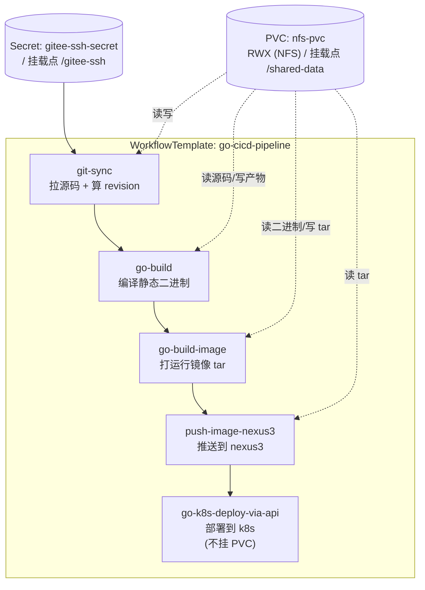
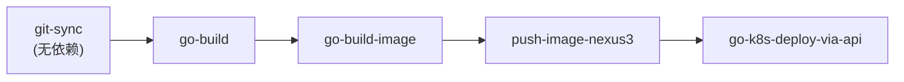

# go-cicd-pipeline 技术设计

> 清单文件：[go-cicd-pipeline.yaml](../../pipelinetemplate/go-cicd-pipeline.yaml)

---

## 一、背景与定位

`go-cicd-pipeline` 是一条 **Go 应用全链路 CICD 流水线**。它本身不实现任何具体动作，而是以 **DAG** 方式编排五个已发布的子任务（`WorkflowTemplate`），把「拉代码 → 编译 → 打镜像 → 推仓库 → 部署」串成一条线，并负责它们之间的**参数衔接**与**共享存储/凭据声明**。

整条流水线的拓扑是一条线性依赖链：

```
git-sync ──> go-build ──> go-build-image ──> push-image-nexus3 ──> go-k8s-deploy-via-api
 (拉源码)    (编译二进制)   (打运行镜像 tar)    (推到 nexus3)        (直调 k8s API 部署)
```

| 子任务 | 定位 | 清单 / 设计文档 |
| --- | --- | --- |
| `git-sync` | 同步 Git 仓库到共享 PVC，算出版本元数据（commit、时间戳、revision） | [git-sync.yaml](../../basetasktemplate/code/git-sync.yaml) / [git-sync设计](../代码/git-sync设计.md) |
| `go-build` | 在 Go 工具链容器里把源码编译成静态二进制，落到 PVC | [go-build.yaml](../../basetasktemplate/build/go-build.yaml) / [go-build设计](../构建/go-build设计.md) |
| `go-build-image` | 用 buildkitd 把二进制包装成最小运行镜像，导出 docker tar | [go-build-image.yaml](../../basetasktemplate/build/go-build-image.yaml) |
| `push-image-nexus3` | 用 skopeo 把 docker tar 推送到 nexus3 docker-hosted 仓库 | [push-image-nexus3.yaml](../../basetasktemplate/nexus3/push-image-nexus3.yaml) / [镜像构建与推送设计](../构建/镜像构建与推送设计.md) |
| `go-k8s-deploy-via-api` | 直调 k8s API（Server-Side Apply）创建/更新 Deployment+Service，轮询就绪 | [go-k8s-deploy-via-api.yaml](../../basetasktemplate/deploy/go-k8s-deploy-via-api.yaml) / [部署设计](../部署/go-k8s-deploy-via-api设计.md) |

运行环境：k8s v1.23.3 + Argo Workflows v3.4.8 + 基于 NFS 的共享 PVC（`nfs-pvc`），全部任务在 `argo` 命名空间。

---

## 二、设计目标

| 目标 | 说明 |
| --- | --- |
| **职责单一** | 本模板只做编排与参数衔接，所有具体逻辑下沉到子任务；子任务可独立迭代、独立测试 |
| **DAG 可扩展** | 用 DAG 而非 steps，线性链之上后续可低成本插入并行/旁路节点（单测、集成测试、通知、审批等） |
| **最少必填** | 用户只需提供 `app-name`、`git-url`、`git-branch` 三个必填项即可跑通，其余全部带合理默认 |
| **单一制品版本** | 整条链共享同一个 `revision`（git-sync 算出）作为镜像 tag，保证唯一、可追溯、各节点所见一致 |
| **小数据走 param，大产物走 PVC** | 节点间只传路径/元数据（parameters），源码、二进制、镜像 tar 都落在共享 PVC，不塞进参数 |
| **松耦合复用** | 子任务以 `templateRef` 按名引用，互不内联；任一子任务升级不影响本模板结构 |

---

## 三、整体架构

所有构建相关 Pod（git-sync / go-build / go-build-image / push-image-nexus3）挂载**同一个 NFS PVC** 到 `/shared-data`，文件系统层面天然共享，节点间无需显式传文件——只传「路径」即可。`go-k8s-deploy-via-api` 是唯一不挂 PVC 的节点（它用 in-cluster ServiceAccount token + CA 直连 k8s API）。



**PVC 内目录流转（一次运行 `wf-xxx`）：**

```
/shared-data/
├── git/                          # git-sync：跨 run 复用的仓库缓存（增量 fetch）
│   └── {app-name}/
├── git-lock/                     # git-sync：flock 文件锁（按 app-name 互斥）
├── workspace/                    # git-sync 写入 → go-build 只读消费
│   └── {workflow.name}/git/      # rsync 后的源码快照
├── target/                       # go-build 写入 → go-build-image 只读消费
│   └── {workflow.name}/{revision}      # 静态二进制产物
└── image/                        # go-build-image 写入 → push-image-nexus3 只读消费
    └── {workflow.name}/{app-name}-{env}-{tag}.tar   # docker tar（实际文件名见子模板）
```

> PVC 搭建见 [基于NFS的PV-PVC共享存储搭建.md](../存储/基于NFS的PV-PVC共享存储搭建.md)，清单 `pvc/nfs-pvc.yaml`，PVC 名 `nfs-pvc`。

---

## 四、运行前置条件（环境依赖）

本流水线依赖**全部五个子任务的前置条件之和**，外加它们之间的共享资源。逐项核对：

| 依赖 | 说明 | 参考 |
| --- | --- | --- |
| k8s 集群 | v1.23.3 | [k8s搭建](../../环境搭建/k8s/v1.23.3.md) |
| Argo Workflows | v3.4.8（部署于 `argo` ns） | [argo-workflows搭建](../../环境搭建/argo-workflows/v3.4.8.md) |
| 共享 PVC | `nfs-pvc`（RWX），挂载到 `/shared-data` | [NFS PV/PVC 搭建](../存储/基于NFS的PV-PVC共享存储搭建.md) |
| Gitee SSH Secret | `gitee-ssh-secret`（git-sync 拉私有仓用） | `secrets/gitee-ssh-secret.yaml` |
| Nexus3 | docker-hosted 仓库（HTTP 8082）+ 账号 | [nexus3搭建](../../环境搭建/制品仓库/nexus3搭建.md) |
| Nexus 凭据 Secret | `nexus-credentials`（key: username/password，推送用） | 见 [镜像构建与推送设计](../构建/镜像构建与推送设计.md) |
| imagePullSecret | `nexus-registry-credentials`（部署侧拉私有镜像用） | 见 [go-k8s-deploy-via-api设计](../部署/go-k8s-deploy-via-api设计.md) |
| buildkitd | 集群内 `Deployment+Service`，`tcp://buildkitd:1234` | [go-build-image.yaml](../../basetasktemplate/build/go-build-image.yaml) |
| 运行时基础镜像 | `192.168.10.134:8082/go-runtime-base:alpine-3.22` | [go运行时基础镜像构建](../工具/go运行时基础镜像构建.md) |
| deploy-role（RBAC） | argo SA 对 deployment/service 的读写权限 | `环境搭建/argo-workflows/yml/deploy-role.yml` |
| 五个子任务模板 | 已 `kubectl apply` 到 `argo` ns | 见第十节 |
| 构建镜像 | `golang:1.26.4-alpine`（自带 Go 工具链） | 国内建议预加载后改 `imagePullPolicy: Never` |

> ⚠️ **卷声明必须由父流水线承担**：通过 `templateRef` 调用子任务时，Argo **不会**带入子模板 `spec.volumes` 里声明的卷。因此本模板在自身 `spec.volumes` 中声明了 `shared-data`（PVC `nfs-pvc`）和 `gitee-ssh`（Secret `gitee-ssh-secret`）两个同名卷。子模板里保留 volumes 声明仅为文档化与独立测试用。

---

## 五、子任务与 DAG 编排

`templates[0]`（名为 `main`）是一个 `dag`，含五个 task，依赖关系如下：



每个 task 以 `templateRef` 引用同名 WorkflowTemplate 的 `entrypoint`，把上游 task 的 output parameter 透传为下游的 input parameter。线性链上每步都消费上一步的关键产物路径/元数据（见第六节）。

> 选择 DAG 而非 `steps` 的理由：DAG 以「依赖」而非「顺序」表达编排，后续若要在「编译后并行跑单测」「推送后并行通知/部署多环境」等场景扩展，只需加 task 与 `depends`，不必重排顺序结构。

---

## 六、参数衔接与数据流（核心）

节点间只传递**小元数据**（路径、版本号），大产物（源码、二进制、镜像 tar）一律走共享 PVC。下表是整条链的出参 → 入参映射：

| 上游 task.output | 下游 task.input | 含义 |
| --- | --- | --- |
| `git-sync.build-workspace-path` | `go-build.build-workspace-path` | 源码快照目录（rsync 目标） |
| `git-sync.build-artifact-name` | `go-build.build-artifact-name` | 二进制文件名（= revision） |
| `git-sync.build-artifact-name` | `go-build-image.build-image-tag` | 镜像 tag（复用 revision） |
| `go-build.build-artifact-path` | `go-build-image.build-artifact-path` | 二进制绝对路径 |
| `go-build-image.build-image-tar-path` | `push-image-nexus3.build-image-tar-path` | docker tar 路径 |
| `push-image-nexus3.nexus-image-ref` | `go-k8s-deploy-via-api.image-ref` | 最终部署的完整镜像 ref |

> `pipeline-run-name` 在 git-sync / go-build / go-build-image 三处统一取 `{{workflow.name}}`，保证各节点产物落在 PVC 上的同一个 run 子目录，天然并发隔离。

### 6.1 镜像命名：为什么不用 git-sync 的 build-image-name

`git-sync` 内部确实算了一个完整镜像 ref 输出：

```
build-image-name = {artifact-repo-domain}:8082/{build-image-storage-repo}/{app-name}/{env}:{revision}
                 = 192.168.10.134:8082/docker-hosted/{app-name}/{env}:{revision}
```

但本流水线**不消费它**，而是重新组合出 repo 与 tag 交给下游。原因：

- nexus3 的 **docker-hosted 仓库是「端口即仓库」**：`192.168.10.134:8082` 这个端口本身就指向 `docker-hosted` 仓库。因此推/拉镜像时，repo 路径里**不应再包含** `docker-hosted/`。`push-image-nexus3` 的入参模型正是 `registry + repo-name + tag`（repo-name 不含仓库名）。
- 若直接用 git-sync 的 `build-image-name`，会在路径里多出一层 `docker-hosted/`，与 nexus3 模型冲突。

因此本流水线采用：

| 维度 | 取值 | 来源 |
| --- | --- | --- |
| **registry** | `{{workflow.parameters.nexus-docker-registry}}`（如 `192.168.10.134:8082`） | push-image-nexus3 入参 |
| **repo-name** | `{app-name}/{env}`（如 `my-app/dev`） | 派生，不含仓库名 |
| **tag** | git-sync 的 `revision`（`时间戳.分支.short`，分支已去 `/`） | 复用 `git-sync.build-artifact-name` |

最终部署镜像 ref = `192.168.10.134:8082/my-app/dev:20260707...main.a1b2c3d`。

> 复用 `build-artifact-name` 作为 tag 的好处：① 单一制品版本号贯穿全链路，编译产物名 = 镜像 tag，便于反查；② revision 里的分支已做 `/ → -` 替换，是合法 docker tag（tag 允许字母数字 `.` `-` `_`，不可含 `/`，首字符不可为 `.` 或 `-`）。

### 6.2 端口统一为单一 `app-port`

镜像 `EXPOSE`、Deployment `containerPort`、Service `port` 三者在本流水线中默认**取同一个值** `app-port`（默认 9000）。这样避免了「镜像里的端口」与「k8s 里的端口」两个参数不同步导致探针/路由失配的常见坑。若 Service 对外端口需与容器端口不同（如对外 80 → 容器 9000），需自行 fork 模板拆分参数。

---

## 七、入参设计（workflow.arguments）

用户提交流水线时只需关心这些参数。**仅 `app-name`、`git-url`、`git-branch` 必填**，其余全部带默认。

### 7.1 必填

| 参数 | 说明 |
| --- | --- |
| `app-name` | 应用唯一标识；构成 nexus 镜像 repo 路径，`deploy-name` 留空时还作为 Deployment 名（须 DNS-1123：小写字母/数字/`-`） |
| `git-url` | Gitee 仓库 SSH URL，如 `git@gitee.com:xxx/yyy.git` |
| `git-branch` | 目标构建分支 |

### 7.2 可选（带默认）

| 参数 | 默认值 | 说明 |
| --- | --- | --- |
| `env` | `dev` | 环境标识（dev/test/prod），构成镜像 repo 路径 |
| `git-default-branch` | `master` | 默认分支，git-sync 首次 clone 与 cleanup 回退用 |
| `build-context-path` | `cmd/server` | Go 主包目录相对工作区位置；单二进制在根目录填 `.` |
| `build-go-env` | `CGO_ENABLED=0` | 编译环境变量前缀（默认静态链接） |
| `build-go-image` | `golang:1.26.4-alpine` | 自带 Go 工具链的构建镜像 |
| `build-runtime-base-image` | `192.168.10.134:8082/go-runtime-base:alpine-3.22` | 运行时基础镜像（最终镜像 FROM） |
| `app-port` | `9000` | 应用端口（镜像 EXPOSE / containerPort / Service port） |
| `nexus-docker-registry` | `192.168.10.134:8082` | nexus3 docker-hosted 地址（host:port） |
| `nexus-credential-secret` | `nexus-credentials` | nexus 账号密码 Secret |
| `nexus-insecure` | `true` | 是否跳过 TLS（HTTP 仓库需 true） |
| `artifact-repo-domain` | `192.168.10.134` | Nexus 主机（仅供 git-sync 内部计算，本流水线不消费） |
| `deploy-name` | *(空)* | Deployment/Service 名（DNS-1123）；留空回退 `app-name` |
| `deploy-namespace` | `argo` | 部署目标 ns（需存在，deploy-role 也在此） |
| `deploy-replicas` | `2` | 副本数 |
| `deploy-cpu-limit` / `deploy-mem-limit` | `200m` / `512Mi` | 单 pod 资源（requests=limits） |
| `deploy-health-path` | `/healthz` | 健康检查路径（readinessProbe 判据） |
| `deploy-image-pull-policy` | `Always` | 应用镜像拉取策略 |
| `deploy-image-pull-secret` | `nexus-registry-credentials` | 拉私有镜像用的 imagePullSecret |

> `deploy-name` 留空回退 `app-name`，依赖 Argo 表达式模板与 sprig `default` 函数：`{{=default(workflow.parameters.app-name, workflow.parameters.deploy-name)}}`（deploy-name 非空用它，否则 app-name）。Argo 3.4+ 支持。若你的版本不支持表达式模板，提交时显式传 `-p deploy-name=...` 即可。

---

## 八、关键设计决策

### 8.1 编排用 WorkflowTemplate 而非 Workflow

本清单是 `kind: WorkflowTemplate`（与五个子任务一致），是**可复用定义**而非一次性运行实例。好处：

- 与仓库既有约定统一（`basetasktemplate/*` 全是 WorkflowTemplate）；
- 可被多个上层 Workflow 以 `workflowTemplateRef` 引用，或被 `argo submit --from` 直接运行（见第十节）；
- 参数集中声明在 `spec.arguments.parameters`，是流水线的「对外接口契约」。

### 8.2 子任务一律 templateRef，不内联

五个 task 全部以 `templateRef: { name, template: entrypoint }` 按名引用。这意味着：

- 子任务可独立 `kubectl apply` 升级，本模板无需改动；
- 本模板文件保持精简，只描述「谁依赖谁、传什么参数」；
- 缺点是运行时要求五个子任务必须先存在于集群中（见第十节 apply 顺序）。

### 8.3 单一 revision 贯穿全链

git-sync 是唯一算「版本号」的节点。它的 `build-artifact-name`（= revision）同时作为：① 二进制产物文件名；② 镜像 tag。下游不再各自重新算版本，保证「同一次运行的所有产物指向同一个 commit」。这是可追溯、可回滚的基础。

### 8.4 端口、命名等易错项收敛为单一参数

`app-port` 统一喂给镜像与 k8s；镜像 repo 路径由 `app-name/env` 派生；`deploy-name` 回退 `app-name`。这些收敛减少了「参数 A 改了、参数 B 忘改」导致的失配。

### 8.5 错误码语义沿用子任务

本模板不引入新的错误码。各子任务已统一采用 `100=用户错误 / 110=构建错误 / 170=外部依赖错误` 的约定（见各子任务设计文档）。任一 task 失败，DAG 会跳过其下游，整条流水线标记 Failed，Argo UI 上可直接定位到失败节点与退出码。

---

## 九、资源与调度

本模板自身不设 `activeDeadlineSeconds` / `resources`（这些在各子任务模板内已定义）。汇总各节点的资源/时限设定：

| 节点 | CPU limit | 内存 limit | activeDeadline |
| --- | --- | --- | --- |
| git-sync | 0.5 | 1Gi | 1800s |
| go-build | 2 | 2Gi | 1800s |
| go-build-image | 1 | 1Gi | 1800s |
| push-image-nexus3 | 0.5 | 512Mi | 900s |
| go-k8s-deploy-via-api | 0.3 | 256Mi | 900s |

全部 `nodeSelector: kubernetes.io/os: linux`，`serviceAccountName: argo`。线性链的总耗时≈各节点耗时之和（无并行），最重的环节是 `go-build`（编译）与 `go-k8s-deploy-via-api`（rollout 轮询）。

---

## 十、清单文件与使用方式

### 10.1 清单文件

完整清单见 [go-cicd-pipeline.yaml](../../pipelinetemplate/go-cicd-pipeline.yaml)（本文不重复贴 YAML，以清单为准）。

### 10.2 一次性 apply 全部前置资源

```shell
# 1. 共享存储（NFS PV/PVC）
kubectl apply -f pvc/nfs-pv.yaml
kubectl apply -f pvc/nfs-pvc.yaml

# 2. 凭据（Gitee SSH、Nexus 账号、镜像拉取）
kubectl apply -f secrets/gitee-ssh-secret.yaml -n argo
kubectl apply -f secrets/nexus-credentials.yaml   -n argo   # nexus 账号密码（key: username/password）
kubectl apply -f secrets/nexus-registry-credentials.yaml -n argo  # imagePullSecret（dockerconfigjson）

# 3. RBAC（argo SA 管理 deployment/service）
kubectl apply -f 环境搭建/argo-workflows/yml/deploy-role.yml -n argo

# 4. buildkitd（镜像构建依赖）
kubectl apply -f basetasktemplate/tools/buildkitd.yaml -n argo

# 5. 五个子任务模板（必须在流水线之前 apply）
kubectl apply -f basetasktemplate/code/git-sync.yaml                -n argo
kubectl apply -f basetasktemplate/build/go-build.yaml               -n argo
kubectl apply -f basetasktemplate/build/go-build-image.yaml         -n argo
kubectl apply -f basetasktemplate/nexus3/push-image-nexus3.yaml     -n argo
kubectl apply -f basetasktemplate/deploy/go-k8s-deploy-via-api.yaml -n argo

# 6. 本流水线模板
kubectl apply -f pipelinetemplate/go-cicd-pipeline.yaml -n argo
```

### 10.3 运行方式一：argo submit --from（推荐）

```shell
argo submit --from workflowtemplate/go-cicd-pipeline -n argo \
  -p app-name=my-app \
  -p git-url=git@gitee.com:xxx/my-app.git \
  -p git-branch=main
# 可选覆盖示例：
#   -p env=prod -p deploy-namespace=my-app-prod -p deploy-replicas=3
```

只传三个必填项即可跑通；其余参数走默认值。

### 10.4 运行方式二：薄 Workflow 包装

若想固定部分参数（如某环境专用）、或纳入 GitOps/CI 触发，可用一个极薄的 `Workflow` 引用本模板：

```yaml
apiVersion: argoproj.io/v1alpha1
kind: Workflow
metadata:
  generateName: my-app-cicd-
  namespace: argo
spec:
  workflowTemplateRef:
    name: go-cicd-pipeline
  arguments:
    parameters:
      - name: app-name
        value: my-app
      - name: git-url
        value: git@gitee.com:xxx/my-app.git
      - name: git-branch
        value: main
      # 其余参数走模板默认，或在此覆盖
```

### 10.5 验证

```shell
argo watch @latest -n argo                # 实时观察 DAG 各节点状态
argo logs @latest -n argo                 # 查看日志（失败节点会打印带错误码的中文提示）
kubectl -n argo get deploy,svc -l app=my-app   # 部署完成后核对产物
```

部署成功后，`go-k8s-deploy-via-api` 的 output `deploy-status` 为 `SUCCEEDED`，`deploy-service-clusterip` 给出 Service ClusterIP。

---

## 十一、后续演进（TODO）

| 项 | 说明 |
| --- | --- |
| 单测/集成测试节点 | 在 `go-build` 后并行插入单测 task（`depends: go-build`），失败则阻断下游 |
| 制品归档 | 把二进制/镜像 digest 归档到 nexus3 raw 仓库或制品库，便于审计与回滚 |
| 多环境部署 | 推送后用 fan-out 同时部署到 dev/test/prod（多 task 共享 `depends: push-image-nexus3`） |
| 人工审批 | 关键环境（prod）部署前插入 Argo 的 `approval` / 状态卡节点 |
| 通知 | 流水线结束（成功/失败）推送钉钉/飞书/邮件 |
| 回滚 | 提供按历史 tag 重新部署的旁路流水线 |
| Service 端口解耦 | 当对外端口需与容器端口不同时，把 `app-port` 拆为 `container-port` / `service-port` |
| 资源/超时上浮 | 把 `activeDeadlineSeconds`、resources 提到本模板统一管控，便于按应用调优 |
| 镜像 tag 选项化 | 当前固定用 revision；可增加 `image-tag-strategy`（revision / commit / timestamp / 语义版本）开关 |

---

## 十二、参考资料

- 子任务设计：[git-sync设计](../代码/git-sync设计.md) · [go-build设计](../构建/go-build设计.md) · [镜像构建与推送设计](../构建/镜像构建与推送设计.md) · [go-k8s-deploy-via-api设计](../部署/go-k8s-deploy-via-api设计.md)
- 环境：[基于NFS的PV-PVC共享存储搭建](../存储/基于NFS的PV-PVC共享存储搭建.md) · [go运行时基础镜像构建](../工具/go运行时基础镜像构建.md) · [argo-workflows搭建](../../环境搭建/argo-workflows/v3.4.8.md) · [k8s搭建](../../环境搭建/k8s/v1.23.3.md)
- 清单文件：[go-cicd-pipeline.yaml](../../pipelinetemplate/go-cicd-pipeline.yaml)
