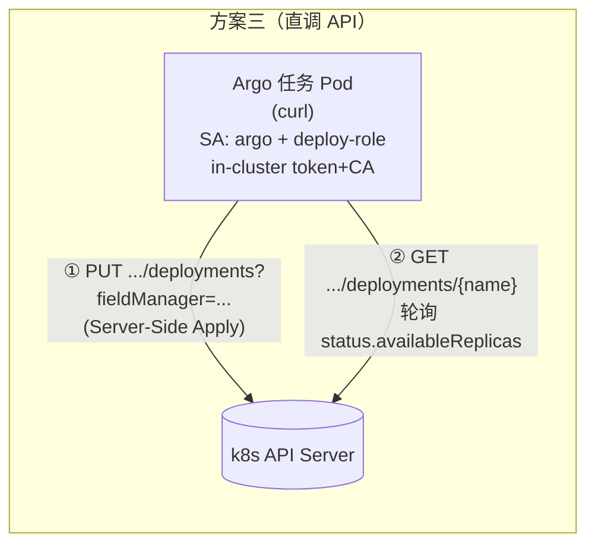
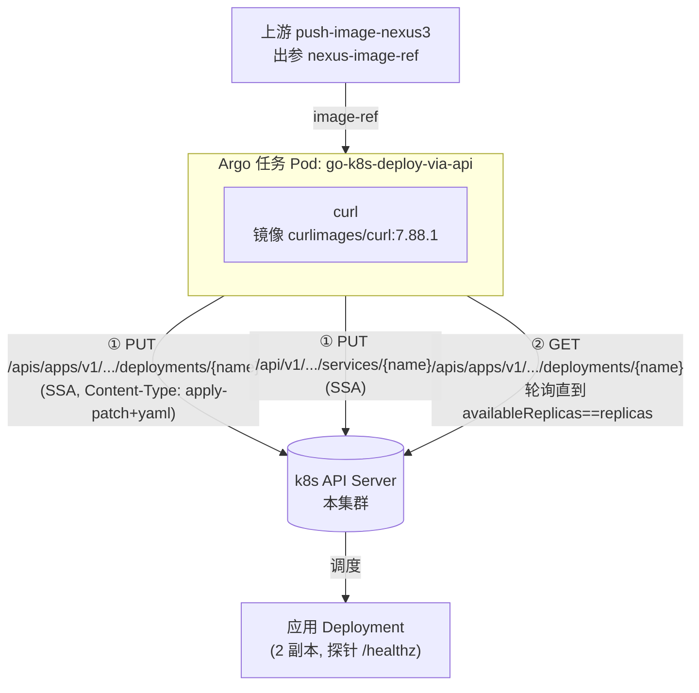
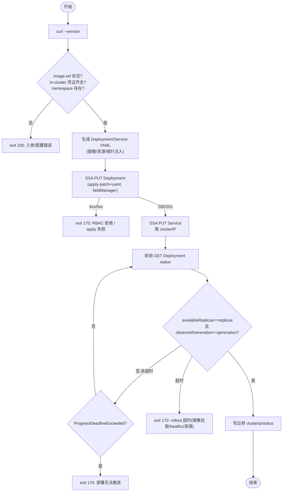

# 方案三：直接调 k8s REST API 部署（go-k8s-deploy-via-api）

> 清单文件：
> - [go-k8s-deploy-via-api.yaml](../../basetasktemplate/deploy/go-k8s-deploy-via-api.yaml) —— 用 `curl` 直接打 k8s API（Server-Side Apply + 轮询 status），不用 kubectl、也不用部署服务
>
> 配套阅读：[方案一 go-k8s-deploy设计.md](./go-k8s-deploy设计.md)（kubectl 直连）、[方案二 go-k8s-deploy-via-service设计.md](./go-k8s-deploy-via-service设计.md)（部署服务代理）

---

## 〇、一句话定位

> **方案三**：在 Argo 任务 Pod 里，**用 `curl` 直接调 k8s 的 REST API** 完成部署——用 **Server-Side Apply** 创建/更新 Deployment+Service，再轮询 Deployment 的 `.status` 等待就绪。不依赖 `kubectl` 二进制，也不经过任何中间服务。

它本质上是**方案一去掉 kubectl 这层壳**：kubectl 内部调的就是这些 API，方案三把它们显式写出来。价值在两点：① **透明**——看清 `kubectl apply` / `kubectl rollout status` 底层到底做了什么；② **去 CLI 依赖**——只需一个带 `curl` 的镜像，不依赖 kubectl 镜像。



> ⚠️ **权限模型与方案一完全相同**：仍用 Argo 挂载到 Pod 的 ServiceAccount token + CA 认证，仍需 [deploy-role.yml](../../环境搭建/argo-workflows/yml/deploy-role.yml) 授权。方案三**没有**把凭证移出流水线（那是方案二的事）——它只是把 `kubectl` 换成了 `curl`。

---

## 一、三方案对比（决策矩阵）

| 维度 | 方案一 go-k8s-deploy | 方案二 go-k8s-deploy-via-service | 方案三 go-k8s-deploy-via-api |
| --- | --- | --- | --- |
| **部署手段** | kubectl CLI（apply + rollout status） | curl 调部署服务 HTTP API | **curl 直调 k8s REST API（SSA + 轮询 status）** |
| **谁打 k8s API** | Argo Pod（kubectl） | 部署服务 | **Argo Pod（curl）** |
| **k8s 写权限归属** | 流水线 SA | 部署服务 | **流水线 SA（同方案一）** |
| **Argo SA 需 k8s 权限** | deployment/service 写 | 无 | **deployment/service 写（同方案一）** |
| **额外组件** | 无 | 自研部署服务（Java） | 无 |
| **客户端镜像** | bitnami/kubectl | curlimages/curl:7.88.1 | **curlimages/curl:7.88.1** |
| **多集群** | ❌ | ✅ | ❌（同方案一，绑死本集群） |
| **透明度/可控** | 中（kubectl 封装细节） | 低（黑盒服务） | **高（每条 HTTP 都可见）** |
| **代码量/复杂度** | 低 | 中（模板简单，但要建服务） | **中（模板里手写 API 调用 + status 解析）** |
| **适合场景** | 学习 demo、单集群、求稳 | 真实 CD、多集群、策略收口 | **学习/理解 k8s API、或想去掉 kubectl 依赖** |

一句话：**方案一≈方案三**（都是流水线直连本集群，权限模型一致），区别只是 kubectl 还是 curl；**方案二**才是架构跃迁（凭证收敛、多集群）。

---

## 二、整体架构



Pod 内凭据来自 Argo 自动挂载的 ServiceAccount：`/var/run/secrets/kubernetes.io/serviceaccount/{token,ca.crt}` + 环境变量 `KUBERNETES_SERVICE_HOST/PORT`——这是 k8s 官方的 in-cluster API 访问方式，kubectl/client 底层用的也是它。

---

## 三、k8s API 细节（本方案用到的几条）

### 3.1 in-cluster 认证（curl 怎么连上 apiserver）

```sh
APISERVER="https://${KUBERNETES_SERVICE_HOST}:${KUBERNETES_SERVICE_PORT}"
TOKEN=$(cat /var/run/secrets/kubernetes.io/serviceaccount/token)
CACERT=/var/run/secrets/kubernetes.io/serviceaccount/ca.crt
curl --cacert "$CACERT" -H "Authorization: Bearer $TOKEN" "$APISERVER/..."
```

- `KUBERNETES_SERVICE_HOST/PORT`：kubelet 注入，指向集群内 apiserver 的 Service `kubernetes`。
- `token`：当前 Pod 的 ServiceAccount token（这里是 `argo` SA）。
- `ca.crt`：集群 CA，校验 apiserver 的 TLS 证书。
- 权限：由 `argo` SA 绑定的 [deploy-role.yml](../../环境搭建/argo-workflows/yml/deploy-role.yml) 决定——`403` 即 RBAC 不足。

### 3.2 声明式 apply：Server-Side Apply（SSA）

「直接调 API 创建或更新一个对象」最干净的方式是 **Server-Side Apply**（`kubectl apply --server-side` 的底层）：

```sh
curl -X PUT \
  -H "Authorization: Bearer $TOKEN" \
  -H "Content-Type: application/apply-patch+yaml" \
  --cacert "$CACERT" \
  --data-binary @/tmp/dep.yaml \
  "$APISERVER/apis/apps/v1/namespaces/{ns}/deployments/{name}?fieldManager=go-k8s-deploy&force=true"
```

要点：
- **方法 PUT 到具名资源**（`/deployments/{name}`，不是 POST 到集合）；
- **`Content-Type: application/apply-patch+yaml`** 是触发 SSA 的开关（普通 `application/yaml` 不会走 SSA）；
- **`fieldManager=go-k8s-deploy`** 标识本调用方拥有的字段；**`force=true`** 在字段与他人冲突时接管（重部署更稳）；
- **存在则更新、不存在则创建**（HTTP `200`=更新、`201`=创建）；body 是**完整期望对象**（含 apiVersion/kind/metadata.name/spec），不含 status。
- Service 同理：`PUT /api/v1/namespaces/{ns}/services/{name}?fieldManager=...&force=true`。

> SSA 自 k8s 1.22 GA，本环境 1.23.3 完全支持。它比「GET→POST/PUT replace」更安全：replace 是整体覆盖（会冲掉别人设的字段），SSA 是按字段归属合并。

### 3.3 等待结果：轮询 Deployment status

`kubectl rollout status` 的本质是看 Deployment 的 `.status`。方案三用裸 GET 轮询，判定**就绪**：

```sh
GET /apis/apps/v1/namespaces/{ns}/deployments/{name}
# 取 .status.availableReplicas / .spec.replicas / .metadata.generation / .status.observedGeneration
```

**成功条件**（与 rollout status 等价）：

```
status.availableReplicas == spec.replicas   # 期望副本数都已「就绪」
且 status.observedGeneration == metadata.generation   # controller 已处理本次变更
且 spec.replicas != 0
```

`availableReplicas` 由 kubelet 按 **readinessProbe** 累计——所以这里的就绪判定**最终仍取决于 `/healthz` 能通**，与方案一的语义一致。

> 另有一条快速失败信号：k8s 在 `progressDeadlineSeconds`（默认 600s）后会在 status 里置 `"reason":"ProgressDeadlineExceeded"`，脚本据此提前失败，不必干等到轮询超时。

---

## 四、模板设计（go-k8s-deploy-via-api）

### 4.1 入参

继承方案一/二的全部镜像/规格入参（`image-ref`/`deploy-name`/`deploy-namespace`/`deploy-replicas`/`deploy-container-port`/`deploy-service-port`/`deploy-cpu-limit`/`deploy-mem-limit`/`deploy-health-path`/`deploy-image-pull-policy`，同名同义），新增 API 对接参数：

| 参数名 | 默认值 | 说明 |
| --- | --- | --- |
| `field-manager` | `go-k8s-deploy` | SSA 的 fieldManager 名 |
| `rollout-timeout` | `480` | 等待就绪超时（秒） |
| `rollout-poll-interval` | `5` | 轮询 status 间隔（秒） |
| `curl-image` | `curlimages/curl:7.88.1` | curl 镜像（**需自带 sh**，见 §六） |

### 4.2 出参

| 参数名 | 说明 |
| --- | --- |
| `deploy-service-clusterip` | Service ClusterIP |
| `deploy-status` | 终态（成功为 `SUCCEEDED`） |

### 4.3 核心流程



### 4.4 关键实现点

- **不依赖 jq**：API 返回多行 JSON，先 `tr '\n' ' '` 折成一行，再用 `grep -o`/`sed` 抽取标量字段（`availableReplicas`/`replicas`/`generation`/`observedGeneration`/`clusterIP`）。这些字段不在数组里，首个匹配即所需，busybox sh 足够。
- **认证数组**：把 `--cacert`、`-H Authorization` 放进 sh 数组 `AUTH=(...)` 复用，每条 curl 都 `"${AUTH[@]}"`，避免重复与拆词。
- **HTTP 状态码即成败**：SSA 返回 `200/201` 视为成功，`401/403` 明确指向 RBAC 问题，其它非 2xx 打印响应体辅助排查。

---

## 五、关键决策

- **为什么用 SSA 而非 GET→create/replace**：replace 是整体覆盖，会冲掉别人（或上次）设的字段；SSA 按字段归属合并、幂等、声明式，是「裸 API 做声明式 apply」的标准答案，也是 `kubectl apply` 的新方向。
- **为什么轮询而非 watch**：`watch` 是流式长连接，在 sh+curl 里解析 SSE 帧繁琐且易错；轮询实现简单、对学习场景足够（间隔 5s，超时 480s）。watch 是后续可优化项。
- **为什么解析 status 不用 jq**：保持镜像轻量（只 curl+busybox）；需要的都是标量字段，折行后 `grep/sed` 即可。若已预焙含 jq 的镜像，替换解析会更清爽（可选）。
- **与方案一的同构性**：方案三 = 方案一换实现（curl 代 kubectl）。两者前置条件、权限、成功语义完全一致，可在父 Workflow 里互换 `templateRef`。

---

## 六、运行前置条件

| 依赖 | 说明 | 与方案一差异 |
| --- | --- | --- |
| **deploy-role RBAC** | argo SA 管理 deployment/service（SSA PUT 需写权限） | **同方案一** |
| 节点信任 nexus3 HTTP 仓库 | 各节点 `daemon.json` 加 `insecure-registries`，否则应用 Pod `ImagePullBackOff` | **同方案一**（不变） |
| **curl 客户端镜像** | `curlimages/curl:7.88.1`（**Alpine，自带 sh+busybox**）；⚠️ `8.x` 是 Wolfi/distroless **无 shell** 不可用。离线可预焙 `alpine+curl(+jq)` 进 nexus3 | 方案一用 kubectl 镜像 |
| 应用 `/healthz` 端点 | readinessProbe 据此累计 availableReplicas | 不变 |
| in-cluster 凭证可挂载 | Argo 默认为 Pod 挂载 SA token/ca（`automountServiceAccountToken` 默认 true） | 同方案一 |

### 关于 curl 镜像为何要自带 sh

Argo `script:` 模板把 `source` 包进 `sh -c` 执行，镜像**必须有 `/bin/sh`**；脚本还要 `tr/grep/sed/date/sleep`（均在 busybox）。`curlimages/curl:7.88.1`（Alpine 系）满足；`8.x`（Wolfi/distroless）**无 shell，不能用**。离线预焙：

```shell
docker pull alpine:3.22
docker run --name bj alpine:3.22 apk add --no-cache curl jq
docker commit bj curl-jq:alpine-3.22 && docker rm bj
docker tag curl-jq:alpine-3.22 192.168.10.134:8082/curl-jq:alpine-3.22
docker push 192.168.10.134:8082/curl-jq:alpine-3.22
# 模板入参 curl-image 改为 192.168.10.134:8082/curl-jq:alpine-3.22（有 jq 可顺手简化解析）
```

### 部署

```shell
kubectl apply -f 环境搭建/argo-workflows/yml/deploy-role.yml     # RBAC（与方案一相同）
kubectl apply -f basetasktemplate/deploy/go-k8s-deploy-via-api.yaml -n argo
```

---

## 七、使用方式（在方案一基础上切换）

> 入参与方案一同名，父 Workflow 里**只改 deploy 任务的 templateRef**：

```yaml
- name: deploy
  depends: push
  templateRef: { name: go-k8s-deploy-via-api, template: entrypoint }   # ← 换成方案三模板
  arguments:
    parameters:
      - name: image-ref
        value: "{{tasks.push.outputs.parameters.nexus-image-ref}}"
      # 其余规格入参沿用默认；field-manager/rollout-timeout 等也都有默认
```

---

## 八、三方案怎么选（建议）

| 你的情况 | 建议 |
| --- | --- |
| 学习 demo、单集群、求稳省事 | **方案一**（kubectl 直连） |
| 想理解 k8s API / 去掉 kubectl 依赖 / 教学 | **方案三**（curl 直调 API） |
| 真实 CD：多集群 / 策略收口 / 凭证收敛 | **方案二**（部署服务代理） |
| 部署服务还没建、但已规划 | 先方案一或三，预留入参，服务就绪后切方案二 |

> 方案一与方案三可视为「流水线直连本集群」的两种实现，按团队偏好二选一；方案二是独立的架构演进方向。

---

## 九、后续演进（TODO）

| 项 | 说明 |
| --- | --- |
| watch 替代轮询 | 用 `?watch=true&resourceVersion=...` 流式监听 status 变化，降低延迟与请求量（sh+curl 解析 SSE 较繁琐，可换 python/jq） |
| jq 解析 | 预焙含 jq 的镜像后，status 解析改用 jq，更稳健可读 |
| 资源删除/回滚 | 加 `DELETE` 端点调用或 `rollback`（Deployment rollback 已 deprecated，回滚靠 re-apply 旧镜像） |
| 多对象/复杂清单 | 多资源可逐个 SSA PUT，或演进为方案二（部署服务统一渲染） |
| 镜像 digest | 用 `repo@sha256:...` 替代可变 tag |

---

## 十、参考资料

- [go-k8s-deploy设计.md](./go-k8s-deploy设计.md) —— 方案一（kubectl 直连，同权限模型）
- [go-k8s-deploy-via-service设计.md](./go-k8s-deploy-via-service设计.md) —— 方案二（部署服务代理）
- [镜像构建与推送设计.md](../构建/镜像构建与推送设计.md) —— 上游 push-image-nexus3（提供 `nexus-image-ref`）
- [deploy-role.yml](../../环境搭建/argo-workflows/yml/deploy-role.yml) —— RBAC（方案三与方案一相同）
- [nexus3搭建.md](../../环境搭建/制品仓库/nexus3搭建.md) / [docker_v28.2.2.md](../../环境搭建/docker/docker_v28.2.2.md) —— 节点 insecure-registries 前置条件
- 外部：[Server-Side Apply 文档](https://kubernetes.io/docs/reference/using-api/server-side-apply/)、[Accessing the API from a Pod（in-cluster）](https://kubernetes.io/docs/tasks/run-application/access-api-from-pod/)、[Deployment status 字段](https://kubernetes.io/docs/reference/generated/kubernetes-api/v1.23/#deploymentstatus-v1-apps)
- 清单文件：[go-k8s-deploy-via-api.yaml](../../basetasktemplate/deploy/go-k8s-deploy-via-api.yaml)
