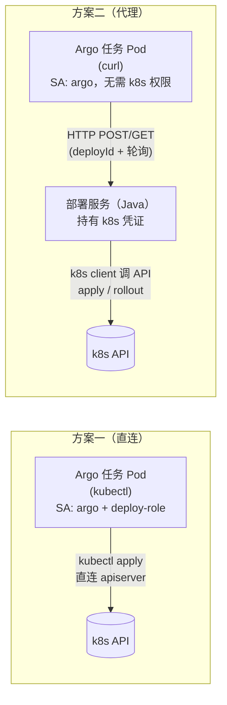
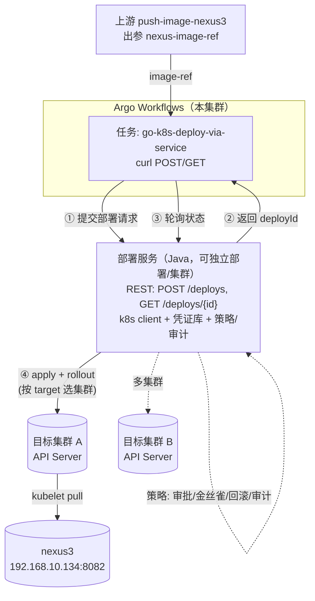
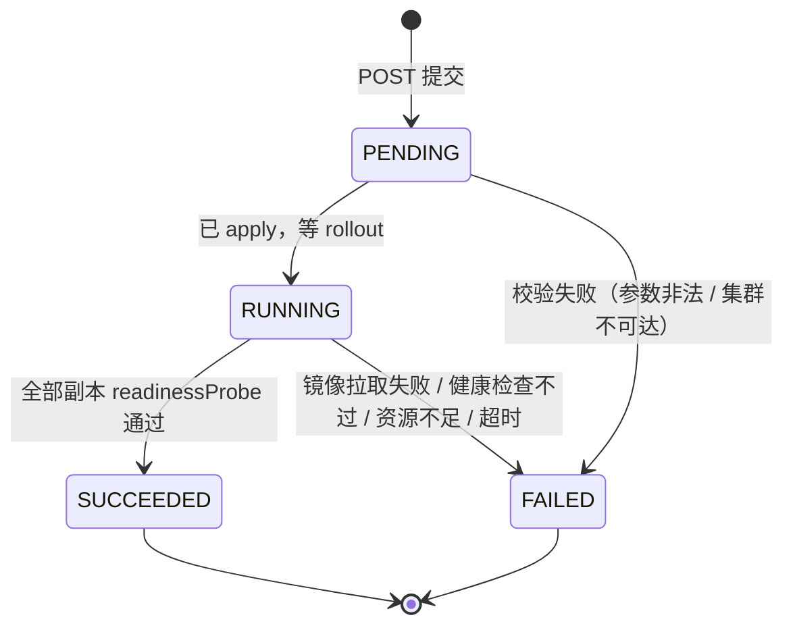
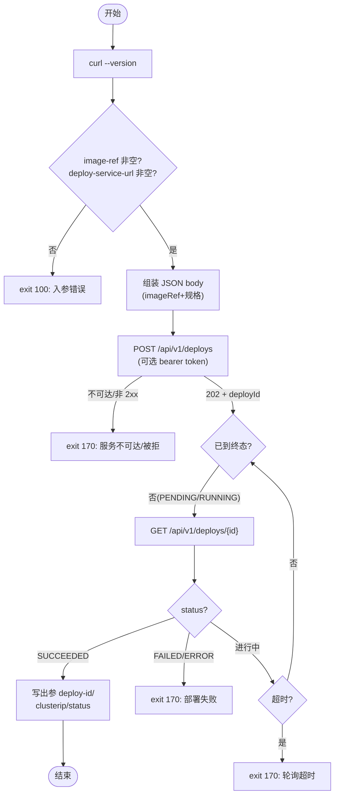

# 方案二：经部署服务代理的 k8s 部署（go-k8s-deploy-via-service）

> 清单文件：
> - [go-k8s-deploy-via-service.yaml](../../basetasktemplate/deploy/go-k8s-deploy-via-service.yaml) —— Argo 侧模板：调用部署服务 HTTP API，不直接碰 k8s
>
> 配套阅读：[方案一 go-k8s-deploy设计.md](./go-k8s-deploy设计.md)（直连 kubectl）、[方案三 go-k8s-deploy-via-api设计.md](./go-k8s-deploy-via-api设计.md)（curl 直调 k8s API）—— 方案一/三都是流水线直连本集群（权限在流水线侧），本方案二才是把凭证收敛到部署服务的架构跃迁

---

## 〇、一句话定位

> **方案一**：Argo 任务 Pod 里跑 `kubectl`，**直接**打 k8s API 部署（k8s 写权限在流水线）。
> **方案二**：Argo 任务 Pod 只是个 HTTP 客户端，**调用自研「部署服务」**的 REST API；由部署服务**持有 k8s 凭证**、调 k8s API 完成真正的部署。

两者最终都打到 k8s API Server——区别只是「**谁来持凭证、谁来发请求**」。方案二在两者之间插了一个**部署服务（broker）**。



**何时用方案二**：当你准备做「真正的 CD」——需要多集群部署、统一部署策略/审批/审计、或不想让流水线持有集群写权限时。对当前学习 demo，[方案一](./go-k8s-deploy设计.md) 已足够。

---

## 一、背景与定位

学习阶段的流水线（git-sync → go-build → go-build-image → push-image-nexus3 → go-k8s-deploy）已经跑通「源码到上线」的闭环。但 `go-k8s-deploy`（方案一）把 **k8s 写权限直接放进了流水线**：每个部署任务 Pod 都用 `argo` SA + `deploy-role` 去 patch 集群资源。这在 demo 里没问题，往真实 CD 演进时有几个痛点：

1. **凭证分散**：凡是能跑部署任务的执行环境，都持有 k8s 写权限；集群越多、团队越多越难收口。
2. **绑死单集群**：方案一只能部署到「Argo 自己跑的那个集群」（学习环境里恰好复用），无法 dev/prod/多集群。
3. **策略散落**：滚动/金丝雀、镜像来源校验、审批、回滚、审计——如果写进每个 Argo 模板，会重复且难演进。
4. **可复用性差**：手动运维、外部 webhook、其它 CI 想触发部署时，没有统一入口。

**方案二**用一个独立的**部署服务**（计划用 Java 开发）收口这些能力：它对外暴露一套部署 REST API，对内用 k8s client（`client-java` / `fabric8`）调 k8s API。Argo 的部署任务退化为「调用这个 API」的薄客户端。这正是 Argo CD（controller）、Spinnaker、各厂自研部署平台的路子。

> 与方案一的关系：**不是替代，是演进**。两者入参同名同义（`image-ref` 等），在父 Workflow 里互换只需改 `templateRef` + 加一个 `deploy-service-url`。学习阶段继续用方案一，等部署服务就绪再切方案二。

---

## 二、方案一 vs 方案二（决策矩阵）

| 维度 | 方案一 go-k8s-deploy | 方案二 go-k8s-deploy-via-service |
| --- | --- | --- |
| **谁调 k8s API** | Argo 任务 Pod（kubectl） | 部署服务（k8s client） |
| **k8s 写权限归属** | 流水线 SA（`argo` + `deploy-role`） | 部署服务自己的 SA / kubeconfig |
| **Argo SA 需要的 k8s 权限** | deployment/service 写（deploy-role） | **无**（只需能 HTTP 访问部署服务） |
| **多集群** | ❌ 只能本集群 | ✅ 部署服务持多套凭证，按入参选目标 |
| **额外组件** | 无（一个 kubectl Pod） | 需自建+运维部署服务（Java） |
| **部署策略/审批/审计** | 写死在 Argo 模板里 | 集中在部署服务，演进不碰流水线 |
| **失败依赖** | 仅依赖 k8s API | 依赖部署服务可用 + k8s API |
| **任务形态** | 同步（apply + rollout status） | 异步（提交拿 deployId → 轮询状态） |
| **客户端镜像** | bitnami/kubectl | curlimages/curl:7.88.1（Alpine，需自带 sh） |
| **适合场景** | 学习 demo、单集群、轻量 | 真实 CD、多集群、需策略收口 |

---

## 三、整体架构



要点：① 流水线与 k8s **完全解耦**——它只跟部署服务讲话；② 部署服务是**唯一的 k8s 写入口**，凭证、目标集群选择、策略都在它里面；③ 应用 Pod 从 nexus3 拉镜像这件事**不变**（仍需节点 `insecure-registries`，见 [§七](#七运行前置条件)）。

---

## 四、部署服务 API 契约（Java 侧需实现）

> 这是 Argo 模板与部署服务之间的**接口契约**，先把字段、状态机、鉴权定下来，Java 侧照此实现即可。模板里的路径默认值与之对齐（`/api/v1/deploys`）。

### 4.1 提交部署 —— `POST /api/v1/deploys`

**请求体**（JSON）：

| 字段 | 类型 | 必填 | 说明 |
| --- | --- | --- | --- |
| `imageRef` | string | 是 | 完整镜像名，如 `192.168.10.134:8082/go-web-demo:0.0.1` |
| `name` | string | 是 | Deployment/Service 名（DNS-1123） |
| `namespace` | string | 是 | 目标 namespace |
| `replicas` | int | 否 | 副本数 |
| `containerPort` | int | 否 | 容器端口 |
| `servicePort` | int | 否 | Service 端口 |
| `cpuLimit` | string | 否 | 如 `200m` |
| `memLimit` | string | 否 | 如 `512Mi` |
| `healthPath` | string | 否 | 健康检查路径，如 `/healthz` |
| `imagePullPolicy` | string | 否 | `Always` / `IfNotPresent` |

> 生产可再扩展：`targetCluster`（选目标集群）、`strategy`（滚动/金丝雀）、`deployToken`/`callbackUrl` 等。学习阶段先按上表。

**响应**（HTTP `202 Accepted`）：

```json
{ "deployId": "dep-20260706-0001", "status": "PENDING" }
```

### 4.2 查询状态 —— `GET /api/v1/deploys/{deployId}`

**响应**（HTTP `200`）：

```json
{
  "deployId": "dep-20260706-0001",
  "status": "SUCCEEDED",
  "serviceClusterIP": "10.10.5.23",
  "message": "rollout completed, 2/2 ready",
  "startedAt": "2026-07-06T10:00:00Z",
  "finishedAt": "2026-07-06T10:01:12Z"
}
```

### 4.3 状态机



> 模板侧：终态只有 `SUCCEEDED`（成功）与 `FAILED`/`ERROR`（失败）；`PENDING`/`RUNNING`/空值 → 继续轮询。

### 4.4 鉴权

流水线 → 部署服务用 **Bearer Token**（部署服务能部署到生产集群，不能裸奔）：

- 模板通过 `secretKeyRef` 从 Secret 读 `token`（key=`token`），注入为 `DEPLOY_SERVICE_TOKEN`；
- 调用时带 `Authorization: Bearer <token>`；
- `secretKeyRef.optional: true`：**未创建该 Secret 时不报错**，模板以匿名身份调用（学习阶段可先不鉴权）。生产务必创建并校验。

可选 Secret 清单（`secrets/deploy-service-token.yaml`，按需创建，值请替换）：

```yaml
apiVersion: v1
kind: Secret
metadata:
  name: deploy-service-token
  namespace: argo
type: Opaque
stringData:
  token: REPLACE-WITH-A-STRONG-TOKEN   # 与部署服务侧预置的「流水线调用方」token 一致
```

> 后续可演进为 mTLS / OIDC；学习阶段 bearer token 足够。

---

## 五、Argo 侧模板设计（go-k8s-deploy-via-service）

### 5.1 入参

继承方案一的全部镜像/规格入参（`image-ref`/`deploy-name`/`deploy-namespace`/`deploy-replicas`/`deploy-container-port`/`deploy-service-port`/`deploy-cpu-limit`/`deploy-mem-limit`/`deploy-health-path`/`deploy-image-pull-policy`，同名同义，便于直接替换 templateRef），并新增**部署服务对接参数**：

| 参数名 | 默认值 | 必填 | 说明 |
| --- | --- | --- | --- |
| `deploy-service-url` | — | **是** | 部署服务 base URL，如 `http://deploy-service.deploy:8080` |
| `deploy-api-submit-path` | `/api/v1/deploys` | 否 | POST 提交路径 |
| `deploy-api-status-path` | `/api/v1/deploys` | 否 | GET 状态前缀（实际 = base + 此值 + `/{deployId}`） |
| `deploy-service-poll-interval` | `5` | 否 | 轮询间隔（秒） |
| `deploy-service-timeout` | `600` | 否 | 整体轮询超时（秒） |
| `deploy-service-auth-token-secret` | `deploy-service-token` | 否 | bearer token 的 Secret 名；未创建则跳过鉴权 |
| `curl-image` | `curlimages/curl:7.88.1` | 否 | curl 客户端镜像（**需自带 sh**，见 §七） |

### 5.2 出参

| 参数名 | 说明 |
| --- | --- |
| `deploy-id` | 部署服务返回的部署 ID（可据此在服务侧追溯/回滚） |
| `deploy-service-clusterip` | 部署成功后的 Service ClusterIP |
| `deploy-status` | 终态（`SUCCEEDED` / `FAILED`） |

### 5.3 核心流程



### 5.4 关键实现点

- **异步轮询**（而非同步阻塞）：提交立即拿 `deployId` 返回，避免长连接被负载均衡/ingress 切断；轮询用 `date +%s` 计时，到 `deploy-service-timeout` 仍未成功则失败。
- **不依赖 jq**：用 `grep -o` + `sed` 抽取扁平字段（`deployId`/`status`/`serviceClusterIP`/`message`），busybox sh 即可，镜像只需 sh+curl。
- **token 安全传递**：用 positional params（`set -- -H "Authorization: Bearer ..."`）携带，避免 `$var` 拆词破坏含空格的 header 值。
- **可选鉴权**：`secretKeyRef.optional: true`，未建 Secret 时不报错、不带鉴权头，学习阶段零配置可跑。

---

## 六、安全模型（方案二的核心价值）

> **方案二最大的意义不是「能调 HTTP」，而是把 k8s 写权限从流水线收敛到部署服务。**

| 主体 | 持有什么 | 权限范围 |
| --- | --- | --- |
| Argo 流水线 SA（`argo`） | **无 k8s 写权限** | 只需能 HTTP 访问部署服务（+ 可选 bearer token） |
| 部署服务 SA / kubeconfig | 各目标集群的写权限 | **唯一**的 k8s 写入口，可按集群/namespace 收窄、审计、轮换 |

收益：① 流水线被攻破不等于集群被攻破；② 加/换/收口集群只动部署服务；③ 所有部署行为在部署服务侧统一审计、可回放、可回滚。

> 切到方案二后，[deploy-role.yml](../../环境搭建/argo-workflows/yml/deploy-role.yml) 对 `argo` SA 的绑定可移除——那套 deployment/service 权限应改绑到**部署服务自己的 SA**。

---

## 七、运行前置条件

| 依赖 | 说明 | 与方案一的差异 |
| --- | --- | --- |
| **部署服务已部署且可达** | Java 服务对外暴露 `POST/GET /api/v1/deploys`；Argo Pod 能访问其 URL | 方案一无此依赖 |
| **（可选）调用方 token Secret** | `deploy-service-token`（见 4.4），未创建则匿名调用 | 方案一无 |
| **curl 客户端镜像** | `curlimages/curl:7.88.1`（**Alpine 系、自带 sh**）；⚠️ `8.x` 是 Wolfi/distroless **无 shell**，不可用于本模板。离线可预焙 `alpine+curl(+jq)` 进 nexus3 | 方案一用 kubectl 镜像 |
| 目标集群节点信任 nexus3 HTTP 仓库 | 应用 Pod 仍要从 nexus3 拉镜像，节点 `daemon.json` 仍需 `insecure-registries` | **不变**（见方案一 §4.2） |
| 应用 `/healthz` 端点 | 部署服务据此判 rollout 成功 | 不变 |

> ⚠️ 注意：**`insecure-registries` 这个前置条件不随方案变化**——它管的是「k8s 节点能不能从 HTTP 的 nexus3 拉镜像」，跟「谁触发部署」无关。只有 RBAC 与 kubectl 镜像这两项从 Argo 侧移到了部署服务侧。

### 关于 curl 镜像为何要自带 sh

Argo 的 `script:` 模板会把 `source` 包进 `sh -c` 执行，故镜像**必须有 `/bin/sh`**。本模板还要轮询（循环 + `date`/`grep`/`sed`/`sleep`），这些都在 busybox 里。`curlimages/curl:7.88.1` 是 Alpine 系（含 busybox + curl + sh），满足；`8.x` 改用 Wolfi（distroless，无 sh），**不能用于本模板**。如需完全离线：

```shell
# 预焙一个 curl(+jq) 镜像进 nexus3，与本仓库 go-runtime-base 的预焙做法一致
docker pull alpine:3.22
docker run --name bj alpine:3.22 apk add --no-cache curl jq
docker commit bj curl-jq:alpine-3.22 && docker rm bj
docker tag curl-jq:alpine-3.22 192.168.10.134:8082/curl-jq:alpine-3.22
docker push 192.168.10.134:8082/curl-jq:alpine-3.22
# 然后模板入参 curl-image 改为 192.168.10.134:8082/curl-jq:alpine-3.22
```

---

## 八、使用方式

### 8.1 部署服务侧（Java，本仓库不含实现）

按 [§四](#四部署服务-api-契约java-侧需实现) 的契约实现并部署：暴露 `POST /api/v1/deploys`、`GET /api/v1/deploys/{id}`，内部用 `io.kubernetes:client-java`（或 `fabric8`）调 k8s API 做 apply + rollout。把服务自身的 SA 配上 deployment/service 写权限（复用 [deploy-role.yml](../../环境搭建/argo-workflows/yml/deploy-role.yml) 的 Role，改绑到部署服务 SA）。

### 8.2 部署本模板 + （可选）token

```shell
kubectl apply -f basetasktemplate/deploy/go-k8s-deploy-via-service.yaml -n argo
# 可选：开启流水线→部署服务 鉴权
kubectl apply -f - <<'EOF'
apiVersion: v1
kind: Secret
metadata: { name: deploy-service-token, namespace: argo }
type: Opaque
stringData: { token: REPLACE-WITH-A-STRONG-TOKEN }
EOF
```

### 8.3 端到端串联（在方案一基础上切换）

> 入参与方案一同名，父 Workflow 里**只改 deploy 任务的 templateRef + 加 deploy-service-url**：

```yaml
- name: deploy
  depends: push
  templateRef: { name: go-k8s-deploy-via-service, template: entrypoint }   # ← 换成方案二模板
  arguments:
    parameters:
      - name: image-ref
        value: "{{tasks.push.outputs.parameters.nexus-image-ref}}"
      - name: deploy-service-url
        value: "http://deploy-service.deploy:8080"     # ← 新增：部署服务地址
      - name: deploy-namespace
        value: "demo"                                  # 可指向任意目标 ns/集群（由部署服务路由）
      # 其余规格入参沿用默认
```

---

## 九、何时选哪个（建议）

| 你的情况 | 建议 |
| --- | --- |
| 学习 demo、单集群、想最快跑通 | **方案一**（kubectl 直连，零额外组件） |
| 已决定做真实 CD：多集群 / 统一策略 / 审批 / 审计 / 凭证收口 | **方案二**（部署服务代理） |
| 过渡期：流水线已成型，部署服务还没建好 | 先方案一，预留入参，部署服务就绪后平滑切方案二 |

> 推荐路径：**学习阶段用方案一跑通全链路 → 搭建部署服务 → 切方案二**。两者入参对齐，切换成本极低。

---

## 十、后续演进（TODO）

| 项 | 说明 |
| --- | --- |
| 部署服务高可用 | Java 服务多副本 + 无状态（状态写 k8s/DB），避免单点 |
| 多集群路由 | 请求体加 `targetCluster`，部署服务按目标选 kubeconfig |
| 高级部署策略 | 金丝雀/蓝绿（多 Service + 流量切分，或 Argo Rollouts 集成） |
| 异步回调 | 部署完成主动回调流水线 webhook，省去轮询 |
| GitOps 模式 | 部署服务改为「渲染 manifest → 推 git → Argo CD 同步」，声明式漂移检测 |
| 镜像不可变 | 用 `repo@sha256:...` 替代可变 tag，消除「同 tag 不同内容」歧义 |
| mTLS / OIDC | 流水线↔部署服务鉴权从 bearer token 升级 |

---

## 十一、参考资料

- [go-k8s-deploy设计.md](./go-k8s-deploy设计.md) —— 方案一（直连 kubectl），本方案的演进起点
- [镜像构建与推送设计.md](../构建/镜像构建与推送设计.md) —— 上游 push-image-nexus3（提供 `nexus-image-ref`）
- [nexus3搭建.md](../../环境搭建/制品仓库/nexus3搭建.md) —— HTTP 仓库（应用 Pod 拉镜像前置条件不变）
- [docker_v28.2.2.md](../../环境搭建/docker/docker_v28.2.2.md) —— 节点 `daemon.json` 的 `insecure-registries`
- 清单文件：[go-k8s-deploy-via-service.yaml](../../basetasktemplate/deploy/go-k8s-deploy-via-service.yaml)
- 参考实现（外部）：[Argo CD](https://argo-cd.readthedocs.io/)（controller 调 k8s API 同步应用的同类范式）、[Kubernetes Java client](https://github.com/kubernetes-client/java)
