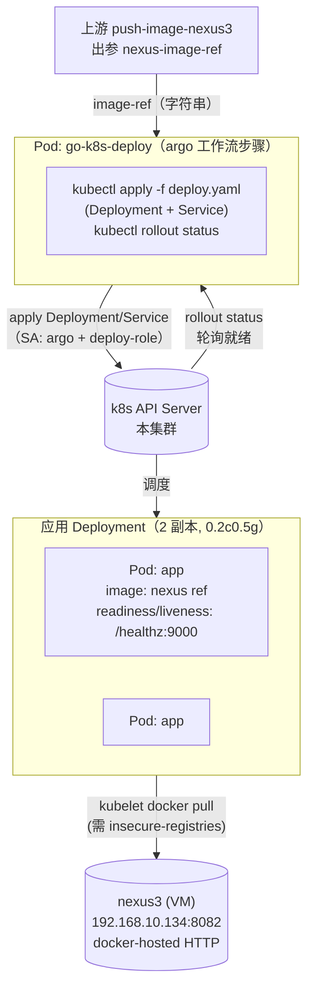
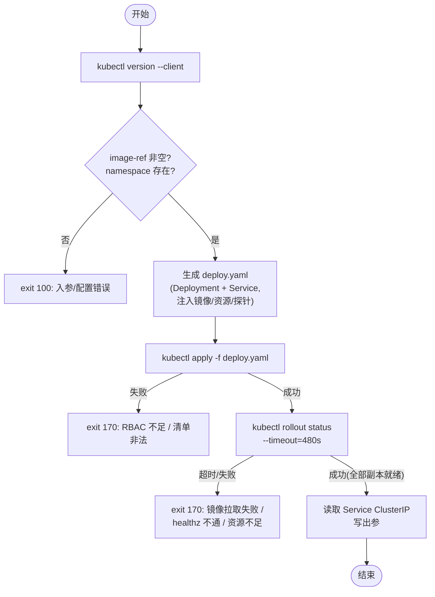

# k8s 部署任务模板技术设计（go-k8s-deploy）

> 清单文件：
> - [go-k8s-deploy.yaml](../../basetasktemplate/deploy/go-k8s-deploy.yaml) —— 接收完整镜像名，部署 Deployment + ClusterIP Service，并以健康检查判定成败
> - [deploy-role.yml](../../环境搭建/argo-workflows/yml/deploy-role.yml) —— 为 argo SA 补充 deployment/service 管理权限（RBAC）
>
> 📌 **本文为方案一（直连 kubectl 部署）**。另有两种备选：
> - **方案二** [go-k8s-deploy-via-service设计.md](./go-k8s-deploy-via-service设计.md) —— 调用自研「部署服务」HTTP API 间接部署（凭证收敛、多集群，真实 CD 方向）
> - **方案三** [go-k8s-deploy-via-api设计.md](./go-k8s-deploy-via-api设计.md) —— 用 curl 直接调 k8s REST API（SSA + 轮询 status，去掉 kubectl 依赖，权限模型与本方案相同）
>
> 三者入参同名，在父 Workflow 里互换 `templateRef` 即可切换。

---

## 一、背景与定位

在 [镜像构建与推送](../构建/镜像构建与推送设计.md) 把镜像推到 nexus3 之后，制品已经是一份「可拉取的镜像 ref」（如 `192.168.10.134:8082/go-web-demo:0.0.1`）。**部署**就是把这份镜像真正跑起来、对外（哪怕是集群内）可访问的最后一步。本文设计的 `go-k8s-deploy` 就是这条链路上的终点节点：

| 节点 | 职责 | 输入 | 输出 |
| --- | --- | --- | --- |
| **push-image-nexus3**（上游） | 把镜像 tar 推到 nexus3，产出完整镜像 ref | 镜像 tar 路径 | `nexus-image-ref`（完整镜像名） |
| **go-k8s-deploy**（本文） | 用 `kubectl` 在目标 k8s 集群部署 Deployment + ClusterIP Service，并等 rollout 成功 | 完整镜像名 | Service ClusterIP / 名称 |

> 本节点**只消费一个字符串入参（镜像名）**，不读共享 PVC 上的任何产物文件——这与上游 git-sync/go-build/push 不同，因此它不挂 `shared-data` 卷，父 Workflow 也无需为它声明该卷。

**运行环境**：k8s v1.23.3 + Argo Workflows v3.4.8 + 虚拟机上的 nexus3（`192.168.10.134:8082`，docker-hosted，**纯 HTTP**）。**部署目标集群复用 argo 所在的集群**（学习环境，资源有限，不另起一套），部署目标 namespace 默认也复用 `argo`。

---

## 二、设计目标

| 目标 | 说明 |
| --- | --- |
| **入参最小化** | 上游只需传一个完整镜像名即可部署，其余（副本数、资源、端口、健康路径）都有合理默认 |
| **声明式 + 幂等** | 用 `kubectl apply` 而非 `create`，重复部署/滚动更新都安全（同一清单多次 apply 结果一致） |
| **健康检查即成败依据** | readinessProbe 打 `/healthz`；`kubectl rollout status` 在「所有副本就绪」时返回 0，**就绪判定正是 readinessProbe**——故 healthz 能通 = 部署成功 |
| **集群内可访问** | 部署为 ClusterIP Service，集群内任意 Pod 可通过 `<svc>.<ns>.svc.cluster.local` 或 ClusterIP 访问 |
| **资源精确受限** | 单 pod `0.2c / 0.5g`（200m / 512Mi），requests = limits（Guaranteed QoS），与需求一致 |
| **失败可定位** | 集中错误码 + 失败时给出具体的 `kubectl describe / events` 排查指引 |
| **RBAC 显式化** | argo 默认 SA 无 deployment/service 权限，单独提供 Role + RoleBinding 清单，不依赖隐式越权 |

---

## 三、整体架构

go-k8s-deploy 的 Pod 只跑 `kubectl`（在 `bitnami/kubectl:1.23` 镜像里），通过 **in-cluster ServiceAccount token** 直连本集群 API Server，对目标 namespace 做 `apply` + `rollout status`。被部署的 **应用 Pod**（Deployment 管控的副本）则由各 k8s 节点的 kubelet 从 nexus3 拉镜像后启动。



两条独立的「拉镜像」链路，务必区分（最易混淆）：

| 链路 | 谁拉 | 拉什么 | 走哪里的 daemon |
| --- | --- | --- | --- |
| **① 部署 Pod 拉 kubectl 镜像** | go-k8s-deploy 所在节点的 kubelet | `bitnami/kubectl:1.23` | 该节点 docker |
| **② 应用 Pod 拉业务镜像** | 应用 Deployment 被调度到的节点 kubelet | `192.168.10.134:8082/go-web-demo:0.0.1` | 该节点 docker（**必须配 insecure-registries**，见 4.2） |

---

## 四、运行前置条件（环境依赖）

| 依赖 | 说明 | 参考 |
| --- | --- | --- |
| **deploy-role RBAC** | 给 `argo` SA 在目标 ns 授予 deployment/service 管理权限；argo 默认 ClusterRole **没有**这些权限 | 见 4.1 |
| **k8s 节点信任 nexus3 HTTP 仓库** | 各节点 docker `daemon.json` 加 `insecure-registries`，否则应用 Pod `ImagePullBackOff` | 见 4.2 |
| **kubectl 客户端镜像** | `bitnami/kubectl:1.23`（自带 sh + kubectl，版本匹配集群）；argoexec 是 distroless 无 kubectl/sh，**不可复用** | 见 4.3 |
| **应用健康检查端点** | 目标镜像需提供 `GET /healthz` 返回 2xx（go-web-demo 即如此） | 见 4.4 |
| 目标 namespace 存在 | 默认 `argo`（已存在）；改其它需自建 | 见 4.5 |
| 上游 push-image-nexus3 | 提供完整镜像名出参 `nexus-image-ref` | [镜像构建与推送设计](../构建/镜像构建与推送设计.md) |

### 4.1 RBAC：为 argo SA 补 deployment/service 权限

argo 官方 `install.yaml` 把 `argo` ServiceAccount 绑定到 `argo-cluster-role`（ClusterRoleBinding `argo-binding`）。但查阅该 ClusterRole（见 [argo3.4.8.yml](../../环境搭建/argo-workflows/yml/argo3.4.8.yml) §`argo-cluster-role`）可知，它**只授权了** `pods` / `configmaps` / `persistentvolumeclaims` / `argoproj.io` / `events` / `poddisruptionbudgets` 等，**不含 deployments / services**。因此 go-k8s-deploy 直接跑会因 RBAC 拒绝而 `kubectl apply` 失败：

```
Error from server (Forbidden): deployments.apps is forbidden: User "system:serviceaccount:argo:argo" cannot create resource "deployments" ...
```

本仓库提供 [deploy-role.yml](../../环境搭建/argo-workflows/yml/deploy-role.yml)（Role + RoleBinding，部署在 `argo` ns，绑定 `argo` SA），授权范围恰好覆盖 `apply` 与 `rollout status` 所需：

| apiGroup | resources | verbs |
| --- | --- | --- |
| `apps` | deployments, deployments/finalizers, replicasets | get/list/watch/create/update/patch/delete |
| `""`（core） | services, services/finalizers, pods, pods/log, events | get/list/watch/create/update/patch/delete |

```shell
kubectl apply -f 环境搭建/argo-workflows/yml/deploy-role.yml
```

> 与 [workflow-role.yml](../../环境搭建/argo-workflows/yml/workflow-role.yml) 同属「补齐 argo 工作流任务所需 RBAC」，故放同目录。

### 4.2 k8s 节点信任 nexus3 的 HTTP 仓库（最易遗漏）

nexus3 docker-hosted 是**纯 HTTP**（8082，无 TLS）。k8s 1.23.3 这套环境的容器运行时是 **docker**（dockershim），默认**拒绝**向未登记的 HTTP 仓库拉镜像，应用 Pod 会直接 `ImagePullBackOff` / `ErrImagePull`。

> 注意区分：你在本地开发机 `docker pull 192.168.10.134:8082/...` 能成功，是因为**那台机器**的 docker 已（或恰好）放行；**k8s 的 master/worker 节点是另一组机器**，必须各自单独配置。

**做法**：在每个 k8s 节点（master + worker）的 `/etc/docker/daemon.json` 里追加 `insecure-registries`，再重启 docker。本仓库 [docker 安装文档](../../环境搭建/docker/docker_v28.2.2.md) 现有 daemon.json 只配了 cgroup/log/storage，需补一项：

```jsonc
{
  "exec-opts": ["native.cgroupdriver=systemd"],
  "log-driver": "json-file",
  "log-opts": { "max-size": "100m" },
  "storage-driver": "overlay2",
  "insecure-registries": ["192.168.10.134:8082"]   // ← 新增：放行 nexus3 HTTP 仓库
}
```

```shell
sudo systemctl daemon-reload
sudo systemctl restart docker
# 验证（节点上直接拉一次，成功即配置生效）
docker pull 192.168.10.134:8082/go-web-demo:0.0.1
```

> 配置后，本集群节点拉 nexus3 HTTP 仓库镜像不再需要 imagePullSecret（nexus3 已开启匿名拉取，见 [nexus3搭建](../../环境搭建/制品仓库/nexus3搭建.md)）。若日后 nexus3 启用 HTTPS，则移除该项并改配 CA。

### 4.3 kubectl 客户端镜像：为什么不能复用 argoexec

直觉上 argo 集群已经预拉了 `quay.io/argoproj/argoexec:v3.4.8`（见 [argo 搭建](../../环境搭建/argo-workflows/v3.4.8.md)），似乎可拿来当 kubectl 容器。但 v3.4.8 的 argoexec [Dockerfile](https://github.com/argoproj/argo-workflows/blob/v3.4.8/Dockerfile) 是 `FROM gcr.io/distroless/static`，**只 COPY 了 `argoexec` 一个二进制**——既没有 `kubectl`，也没有 `sh`。而本模板用 `script:`（需要 sh）且要跑 kubectl，故 **argoexec 不可复用**，必须用一个自带 sh + kubectl 的镜像。

选用 **`bitnami/kubectl:1.23`**：debian 系（有 sh），内置 kubectl，tag `1.23` 跟踪 1.23.x，与集群 v1.23.3 匹配。

```shell
# 方式 A：经镜像加速拉取（轩辕镜像 / 1ms.run，见 环境搭建/镜像加速.md）后 docker load 到各节点
# 方式 B：拉取后转存到本地 nexus3，彻底离线（同样需 4.2 的 insecure-registries）
docker pull bitnami/kubectl:1.23
docker tag  bitnami/kubectl:1.23 192.168.10.134:8082/bitnami-kubectl:1.23
docker push 192.168.10.134:8082/bitnami-kubectl:1.23
# 然后把模板入参 deploy-kubectl-image 改为 192.168.10.134:8082/bitnami-kubectl:1.23
```

> 备选镜像：`registry.k8s.io/kubectl:v1.23.17`（官方，更轻，但国内直连慢）。无论用哪个，都建议预拉取并把模板 `imagePullPolicy` 保持 `IfNotPresent`。

### 4.4 应用健康检查端点

go-web-demo 提供 `GET /healthz`，返回：

```json
{"code":200,"message":"success","data":{"status":"ok","uptime":"27s"}}
```

HTTP 200 即满足 k8s httpGet 探针的默认成功条件。本模板据此配 readinessProbe + livenessProbe（见 5.5）。若换其它服务，改 `deploy-health-path` / `deploy-container-port` 即可。

### 4.5 目标 namespace

默认 `argo`（ns 已存在、deploy-role 也部署在此，**零额外配置**）。若希望应用与 argo 系统组件隔离、部署到独立 ns（如 `demo`）：

```shell
kubectl create namespace demo
# 把 deploy-role.yml 复制一份，metadata.namespace 改成 demo 后 apply
```

并把模板入参 `deploy-namespace` 设为该 ns。> 注：跨 ns 绑定 ServiceAccount 是允许的——RoleBinding 的 subject 可指向 `argo` ns 的 `argo` SA，故无需为部署另建 SA。

---

## 五、go-k8s-deploy 设计

### 5.1 入参（inputs）

| 参数名 | 默认值 | 必填 | 说明 |
| --- | --- | --- | --- |
| `image-ref` | — | **是** | 上游传入的完整镜像名，如 `192.168.10.134:8082/go-web-demo:0.0.1`（取自 push 的 `nexus-image-ref`） |
| `deploy-name` | `go-web-demo` | 否 | Deployment 与 Service 同名，也是 pod label `app`；需 DNS-1123 合法（小写/数字/`-`） |
| `deploy-namespace` | `argo` | 否 | 目标 ns；改其它见 4.5 |
| `deploy-replicas` | `2` | 否 | 副本数 |
| `deploy-container-port` | `9000` | 否 | 容器监听端口，同时是 containerPort 与探针端口 |
| `deploy-service-port` | `9000` | 否 | ClusterIP Service 端口 |
| `deploy-cpu-limit` | `200m` | 否 | 单 pod CPU（0.2 核）；requests = limits |
| `deploy-mem-limit` | `512Mi` | 否 | 单 pod 内存（0.5Gi）；requests = limits |
| `deploy-health-path` | `/healthz` | 否 | 健康检查路径 |
| `deploy-image-pull-policy` | `Always` | 否 | 应用镜像拉取策略；流水线中同 tag 可能被重推新内容，默认 Always 保最新 |
| `deploy-kubectl-image` | `bitnami/kubectl:1.23` | 否 | kubectl 客户端镜像（见 4.3） |

### 5.2 出参（outputs）

| 参数名 | 示例值 | 说明 |
| --- | --- | --- |
| `deploy-service-clusterip` | `10.10.x.x` | Service ClusterIP，供下游/人工验证用 |
| `deploy-service-name` | `go-web-demo` | Service 名称（便于 `<name>.<ns>.svc.cluster.local` 访问） |

### 5.3 核心流程



### 5.4 自动生成的部署清单

go-k8s-deploy **不要求项目自带部署 YAML**，而是按入参当场生成一份 Deployment + Service（heredoc 写到 `/tmp/deploy.yaml`），核心字段：

```yaml
apiVersion: apps/v1
kind: Deployment
metadata:
  name: go-web-demo
  namespace: argo
  labels: { app: go-web-demo, app.kubernetes.io/part-of: pipeline, ... }
spec:
  replicas: 2
  selector: { matchLabels: { app: go-web-demo } }
  strategy:
    type: RollingUpdate
    rollingUpdate: { maxSurge: 1, maxUnavailable: 0 }   # 滚动期间始终保持可用副本
  template:
    metadata: { labels: { app: go-web-demo } }
    spec:
      containers:
        - name: app
          image: 192.168.10.134:8082/go-web-demo:0.0.1   # 上游 image-ref 原样注入
          imagePullPolicy: Always
          ports: [ { name: http, containerPort: 9000 } ]
          resources:
            requests: { cpu: 200m, memory: 512Mi }        # requests = limits → Guaranteed QoS
            limits:   { cpu: 200m, memory: 512Mi }
          readinessProbe: { httpGet: { path: /healthz, port: http }, ... }   # 成败依据
          livenessProbe:  { httpGet: { path: /healthz, port: http }, ... }
---
apiVersion: v1
kind: Service
metadata: { name: go-web-demo, namespace: argo }
spec:
  type: ClusterIP
  selector: { app: go-web-demo }
  ports: [ { name: http, port: 9000, targetPort: http } ]
```

要点：① 端口用**命名端口 `http`**，探针与 Service 都 `port: http` 引用，改端口只改 `deploy-container-port` 一处；② `resources.requests = limits`，精确兑现「单 pod 0.2c0.5g」并取得 Guaranteed QoS；③ 滚动更新 `maxUnavailable: 0`，更新期间不削减可用副本。

### 5.5 健康检查与「部署成功」的判定

这是本模板的核心设计：**用 k8s 原生机制闭环，不自己写 curl 轮询**。

| 探针 | 作用 | 配置 |
| --- | --- | --- |
| **readinessProbe** | 决定 Pod 是否「就绪」、是否收 Service 流量 | `httpGet /healthz:9000`，initialDelay 3s，period 5s，failureThreshold 3 |
| **livenessProbe** | 进程卡死时自动重启 Pod | `httpGet /healthz:9000`，initialDelay 10s，period 10s，failureThreshold 3 |

成功判定用一条命令：

```sh
kubectl rollout status deployment/go-web-demo -n argo --timeout=480s
```

`rollout status` 在「新 ReplicaSet 的副本**全部 Ready**」时返回 0，**而 Ready 的判定正是 readinessProbe 通过**。因此：

> **`/healthz` 能通 → 副本就绪 → rollout status 返回 0 → 部署任务标记成功。**

比在脚本里自己 `while sleep; curl /healthz` 更可靠：① 复用 kubelet 的探针执行与重试语义；② 同时覆盖「镜像拉取失败」「容器 CrashLoopBackOff」「健康检查不过」等多种失败（rollout 超时即报错），失败信息里给出 `kubectl describe pod / get events` 的具体排查命令。

### 5.6 关键决策

- **kubectl apply 而非 create**：声明式、幂等。同一清单多次 apply 结果一致；镜像 tag 变化时 apply 触发滚动更新，`rollout status` 等其完成。
- **rollout status 作为成功依据**：见 5.5，把「健康检查」与「部署成功」用 k8s 原生语义绑定，无需自造轮询。
- **in-cluster SA 鉴权**：Pod 内 kubectl 自动用挂载的 ServiceAccount token + `KUBERNETES_SERVICE_HOST` 直连 API Server，无需 kubeconfig 文件；权限由 4.1 的 deploy-role 提供。
- **默认 imagePullPolicy: Always**：部署流水线里同一 tag（如 `0.0.1`）可能被反复重推新内容，`Always` 保证每次部署取到最新镜像。代价是每次都走一次 nexus3（局域网，成本低）。若改用不可变 tag 或 digest，可设 `IfNotPresent` 省流量。
- **不挂 PVC**：本节点只消费字符串入参，与上游解耦更彻底——任何能产出「镜像名」的上游都可接。

---

## 六、资源与调度

```yaml
# go-k8s-deploy（kubectl Pod）：极轻，只跑几条 kubectl 命令
activeDeadlineSeconds: 600
resources:
  requests: { cpu: "0.1",  memory: "128Mi" }
  limits:   { cpu: "0.3",  memory: "256Mi" }

# 应用 Deployment（被部署出来的业务）：按需求严格受限
replicas: 2
resources:                      # requests = limits（Guaranteed QoS）
  requests: { cpu: "200m", memory: "512Mi" }
  limits:   { cpu: "200m", memory: "512Mi" }
```

> master 节点带 NoSchedule 污点，应用副本与 go-k8s-deploy Pod 都会调度到 worker（6c16g，2×0.2c 完全够）。`activeDeadlineSeconds: 600` 覆盖 kubectl 镜像拉取 + apply + rollout（rollout 内部超时 480s，留有余量）。

---

## 七、清单文件与使用方式

### 7.1 清单文件

- [go-k8s-deploy.yaml](../../basetasktemplate/deploy/go-k8s-deploy.yaml) —— 部署任务模板
- [deploy-role.yml](../../环境搭建/argo-workflows/yml/deploy-role.yml) —— 部署所需 RBAC（Role + RoleBinding）

> 本文不重复贴完整 YAML，以清单为单一事实来源。

### 7.2 前置资源（一次性）

```shell
# 1. 各 k8s 节点放行 nexus3 HTTP 仓库并重启 docker（见 4.2，最易遗漏）
#    /etc/docker/daemon.json 增加 "insecure-registries": ["192.168.10.134:8082"]

# 2. 部署 RBAC（见 4.1）
kubectl apply -f 环境搭建/argo-workflows/yml/deploy-role.yml

# 3. 预拉取 kubectl 镜像（见 4.3）
#    docker pull bitnami/kubectl:1.23   # 或转存到 nexus3 后改 deploy-kubectl-image 入参

# 4. 部署本模板
kubectl apply -f basetasktemplate/deploy/go-k8s-deploy.yaml -n argo
```

### 7.3 端到端串联（父 Workflow，续接 push 节点）

> 注意：与 git-sync/go-build/push 不同，**deploy 不需要 `shared-data` 卷**，故父 Workflow 的 `spec.volumes` 与 deploy 任务无关（保留它是为上游节点）。

```yaml
apiVersion: argoproj.io/v1alpha1
kind: Workflow
metadata:
  generateName: go-pipeline-
spec:
  entrypoint: main
  serviceAccountName: argo
  volumes:                       # 仅为上游 git-sync/go-build/push 声明；deploy 不用
    - name: shared-data
      persistentVolumeClaim:
        claimName: nfs-pvc
  templates:
    - name: main
      dag:
        tasks:
          # ①~③ 同步/编译/打包/推送（见 镜像构建与推送设计.md §9.3，此处省略 sync/build/image）
          - name: push
            depends: image
            templateRef: { name: push-image-nexus3, template: entrypoint }
            arguments:
              parameters:
                - name: build-image-tar-path
                  value: "{{tasks.image.outputs.parameters.build-image-tar-path}}"
                - { name: nexus-repo-name, value: go-web-demo }
                - { name: nexus-image-tag, value: "1.0" }

          # ④ 部署：直接消费 push 的完整镜像名
          - name: deploy
            depends: push
            templateRef: { name: go-k8s-deploy, template: entrypoint }
            arguments:
              parameters:
                - name: image-ref
                  value: "{{tasks.push.outputs.parameters.nexus-image-ref}}"
                # 其余用默认：2 副本 / 0.2c0.5g / /healthz / argo ns
```

### 7.4 验证

部署成功后（go-k8s-deploy 出参 `deploy-service-clusterip` 即为 Service IP），在**集群内**任意 Pod 验证健康检查：

```shell
# 方式 A：通过 ClusterIP（出参值）
curl -s http://<deploy-service-clusterip>:9000/healthz
# {"code":200,"message":"success","data":{"status":"ok","uptime":"..."}}

# 方式 B：通过集群内 DNS（推荐，ClusterIP 会变，DNS 名稳定）
kubectl -n argo exec deploy/go-web-demo -- \
  curl -s http://go-web-demo.argo.svc.cluster.local:9000/healthz

# 方式 C：临时 Pod 进集群访问
kubectl -n argo run curl --rm -it --image=curlimages/curl:8.10.1 --restart=Never -- \
  curl -s http://go-web-demo.argo:9000/healthz

# 查看部署状态
kubectl -n argo get deploy,svc,pod -l app.kubernetes.io/name=go-web-demo
```

> ClusterIP 默认仅集群内可达；要从集群外（宿主机/浏览器）访问，需额外暴露（见 [§八](#八后续演进todo) 的 Ingress / NodePort / port-forward）。

---

## 八、后续演进（TODO）

| 项 | 说明 |
| --- | --- |
| 集群外访问 | 当前仅 ClusterIP；按需加 Ingress（域名+路径）、或 Service 改 NodePort、或临时 `kubectl port-forward` |
| 命名空间隔离 | 默认复用 argo ns；演进为独立 ns（配合 4.5 的 RBAC 复制）甚至独立部署集群 |
| 部署策略 | 当前 RollingUpdate(maxUnavailable=0)；接入蓝绿/金丝雀（多 Service + 流量切分，或 Argo Rollouts） |
| 弹性伸缩 | 加 HPA（按 CPU/自定义指标自动扩缩），需 metrics-server |
| 配置/敏感数据 | 应用需配置项或密钥时，模板增参支持挂 ConfigMap / Secret |
| **演进到方案二** | 把「kubectl 直连」演进为「调用自研部署服务 HTTP API 间接部署」——k8s 写权限收敛到部署服务、支持多集群/统一策略；详见 [go-k8s-deploy-via-service设计.md](./go-k8s-deploy-via-service设计.md) |
| GitOps 化 | 把「生成清单 + apply」演进为推 manifest 到 git + Argo CD 同步（声明式漂移检测） |
| 镜像不可变 | 用 digest（`repo@sha256:...`）替代可变 tag，配合 `imagePullPolicy: IfNotPresent`，避免「同 tag 不同内容」的歧义 |
| 健康检查增强 | 加 startupProbe（慢启动场景），或把 readiness 改更严格的 `/ready`（区分存活与就绪） |

---

## 九、参考资料

- [镜像构建与推送设计.md](../构建/镜像构建与推送设计.md) —— 上游 push-image-nexus3（提供 `nexus-image-ref`）
- [v3.4.8.md](../../环境搭建/argo-workflows/v3.4.8.md) —— argo-workflows 搭建（含 argoexec 预拉取）
- [argo3.4.8.yml](../../环境搭建/argo-workflows/yml/argo3.4.8.yml) —— argo-cluster-role 权限范围（印证需补 deploy-role）
- [workflow-role.yml](../../环境搭建/argo-workflows/yml/workflow-role.yml) —— 同类「补齐工作流 RBAC」先例
- [nexus3搭建.md](../../环境搭建/制品仓库/nexus3搭建.md) —— nexus3 docker-hosted（HTTP 8082、匿名拉取）
- [docker_v28.2.2.md](../../环境搭建/docker/docker_v28.2.2.md) —— 节点 docker daemon.json（4.2 在此追加 insecure-registries）
- [镜像加速.md](../../环境搭建/镜像加速.md) —— kubectl 镜像国内拉取
- 清单文件：[go-k8s-deploy.yaml](../../basetasktemplate/deploy/go-k8s-deploy.yaml)、[deploy-role.yml](../../环境搭建/argo-workflows/yml/deploy-role.yml)
