# nexus3搭建

流水线中构建出来的制品，比如java jar、golang二进制文件，以及基于这些产物构建的docker镜像，都需要保存到制品仓库，常见的有sonatype/nexus3、jfrog artifactory，github、gitlab、阿里云等等也有提供制品管理的功能。

本文使用sonatype/nexus3作为制品仓库，使用docker运行

## 环境信息

- Macbook Pro M5 pro，18c48g，1T硬盘
，macOS 26.5.1
- 虚拟机软件：VMvare Fusion 专业版 13.5.2
- Ubuntu 24.04.4 desktop，2c8g，80g硬盘

## 安装步骤

### 虚拟机安装

参考：[虚拟机安装](../虚拟机安装.md)

### docker安装

详细见：[docker安装](../docker/docker_v28.2.2.md)

### 放开防火墙

Ubuntu 默认一般没开 `ufw`，但如果你启用了，需要放行端口：

```bash
sudo ufw allow 8081/tcp   # Nexus Web UI / Maven / npm / PyPI REST
sudo ufw allow 8082/tcp   # Docker hosted registry（按需多开）
```

### 规划端口

| 端口 | 用途 |
|---|---|
| `8081` | Web UI + 所有 REST 类制品（Maven / npm / PyPI / NuGet / Helm） |
| `8082` | Docker **hosted** registry（HTTP） |
| `8083`（可选） | Docker **proxy** registry（代理 Docker Hub） |
| `8084`（可选） | Docker **group** registry（合并 hosted + proxy） |

> Docker 类仓库**每个独立仓库必须独占一个端口**，所以多开几个端口是正常现象。

### docker-compose 方式 安装

推荐这种方式：配置即文件，便于版本管理、重建、迁移。

#### 创建工作目录与 compose 文件

```bash
mkdir -p ~/nexus && cd ~/nexus
```

新建 `~/nexus/docker-compose.yml`：

```yaml
services:
  nexus:
    image: sonatype/nexus3:3.80.0      # 建议固定版本，如 sonatype/nexus3:3.80.0，建议提前拉取好镜像
    container_name: nexus
    restart: unless-stopped
    ports:
      - "8081:8081"   # Web UI / Maven / npm / PyPI 等 REST 接口
      - "8082:8082"   # Docker hosted registry（HTTP）
      # - "8083:8083" # Docker proxy（按需）
      # - "8084:8084" # Docker group（按需）
    volumes:
      - nexus-data:/nexus-data
    environment:
      # 适配 2c8g 专用机：堆 2703m + 堆外直接内存 2703m（镜像默认值）。若只有 6G 内存，全部改 1500m
      - INSTALL4J_ADD_VM_PARAMS=-Xms2703m -Xmx2703m -XX:MaxDirectMemorySize=2703m -Djava.util.prefs.userRoot=/nexus-data/javaprefs
    ulimits:
      nofile:          # Nexus 官方建议至少 65536，否则启动告警
        soft: 65536
        hard: 65536

volumes:
  nexus-data:
```

#### 启动

```bash
cd ~/nexus
docker compose up -d        # 后台启动
docker compose logs -f nexus # 跟踪启动日志
```

出现如下日志，说明启动成功

```bash
nexus  | -------------------------------------------------
nexus  |
nexus  | Started Sonatype Nexus COMMUNITY 3.80.0-06
nexus  |
nexus  | -------------------------------------------------
```

#### 等待就绪

Nexus 首次启动需要一定时间，用以下命令轮询直到返回 200：

```bash
# 在虚拟机里执行
curl -i http://localhost:8081/ | head -1
# 出现 HTTP/1.1 200 即可访问
```

笔者本地虚拟机测试如下：

```bash
curl -i http://localhost:8081/ | head -1
  % Total    % Received % Xferd  Average Speed   Time    Time     Time  Current
                                 Dload  Upload   Total   Spent    Left  Speed
HTTP/1.1 200 OK    0    0     0      0      0 --:--:-- --:--:-- --:--:--     0
100  8263  100  8263    0     0   103k      0 --:--:-- --:--:-- --:--:--  104k
curl: Failed writing body // 忽略这一条就好
```

> 启动期间日志里可能出现 `Available memory ... below threshold` 之类的提示，通常是内存设置的告警，能正常起起来就不用管。

---

## 登录与设置

### 获取初始管理员密码

首次登录账号是 `admin`，密码在容器内一个文件里：

```bash
docker exec nexus cat /nexus-data/admin.password
```

笔者的输出是：

```bash
c2f24dc6-5926-4037-8c64-bf56f078e303
```

输出的一串字符就是初始密码（末尾没有换行注意别多复制）。

### 登录与初始化向导

1. 浏览器访问 `http://<虚拟机IP>:8081`（笔者是 `http://192.168.10.134:8081`）。

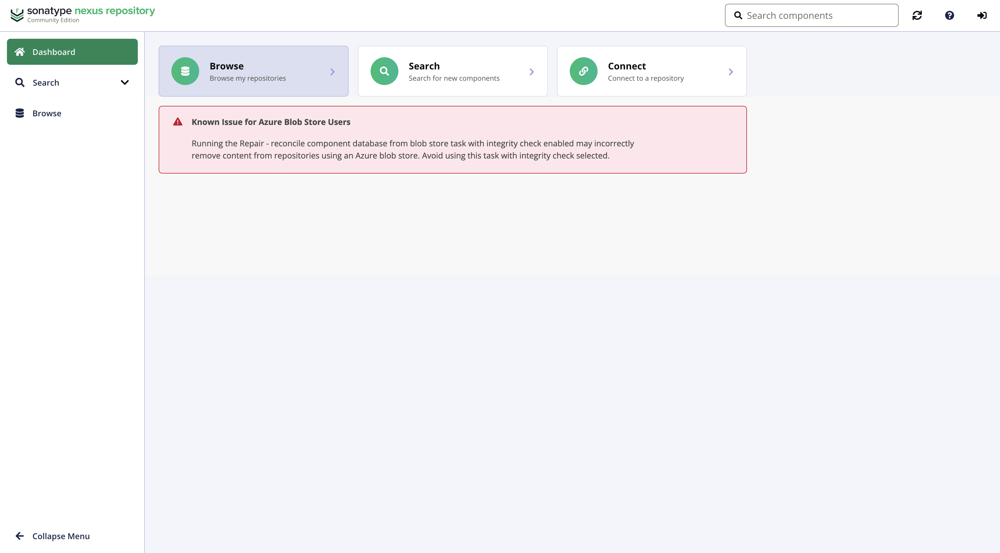

2. 右上角 **Sign in**，用户名 `admin`，密码粘贴上一步的值。

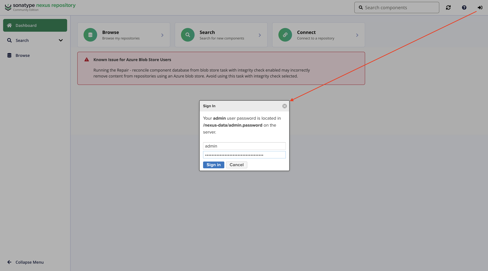

3. 走完初始化向导：
   - **Step 1**：要求改密码 —— 设一个你自己的强密码并记住（后续客户端配置要用），因为学习用，笔者简单设置密码为：admin。
   - **Step 2**：**Configure anonymous access** —— 建议学习阶段选 **Enable anonymous access**（允许匿名拉取公开代理仓库，省去每个客户端都配账号；私有发布仍需账号）。
   - **Step 3**：完成。

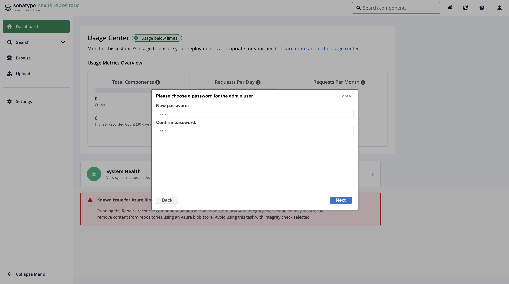

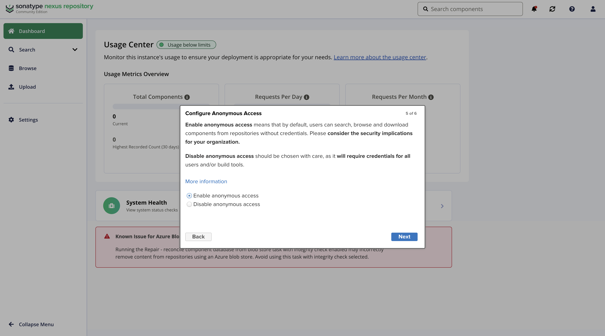

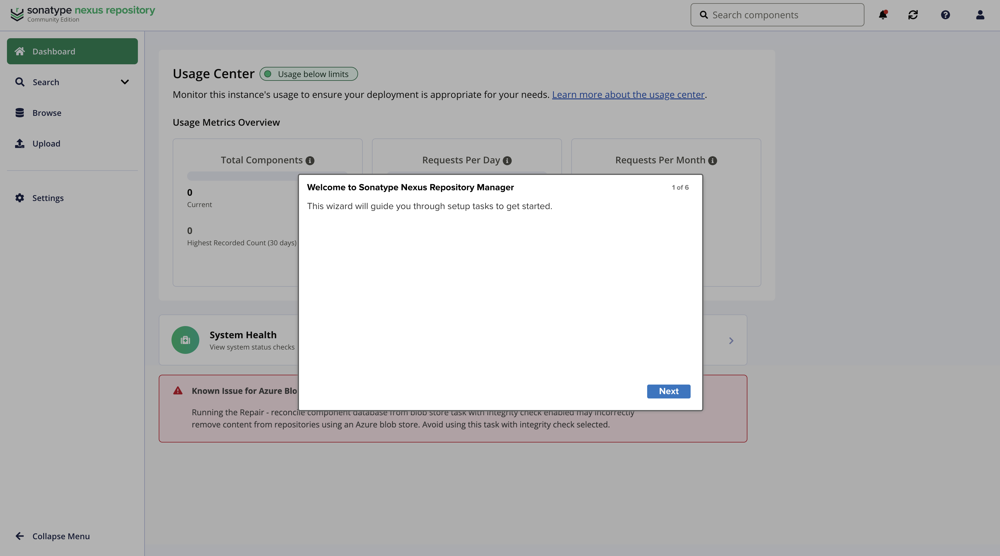

> 关掉匿名访问更安全，但每次拉取都要带账号；学习阶段图方便可开启，生产环境务必关闭。

## Nexus 核心概念

理解这三个角色，配置就豁然开朗：

| 角色 | 作用 | 举例 |
|---|---|---|
| **proxy（代理）** | 代理远端官方源，**拉取一次就缓存到本地**，后续直接走本地 | 代理 Maven Central、npm、PyPI、Docker Hub |
| **hosted（托管）** | 存**你自己**构建出来的私有制品 | `maven-hosted` 存自己的 jar；`docker-hosted` 存自己的镜像 |
| **group（组）** | 把多个 proxy + hosted **合并成一个 URL**，客户端只配一个地址 | `maven-group` = hosted 优先 + central 兜底 |

另外两个基础概念：

- **Blob Store**：制品的**物理存储**后端（默认是个本地文件型存储）。生产可以配 S3；学习用默认即可。
- **Cleanup Policy（清理策略）**：按条件（如「保留最近 N 天」「只删某个仓库的 SNAPSHOT」）自动清理旧制品，节省磁盘。

> Nexus 自带的开箱仓库：`maven-central`（proxy）、`maven-releases` / `maven-snapshots`（hosted）、`maven-public`（group）、`nuget.org-proxy` 等。**你可以直接用自带的，也可以自己建一套**。

## 仓库使用

### 创建仓库

我们创建两个仓库来做示例

- raw-hosted：用于存储原始产物，例如golang build出来的二进制文件

- docker-hosted：用于存储docker镜像

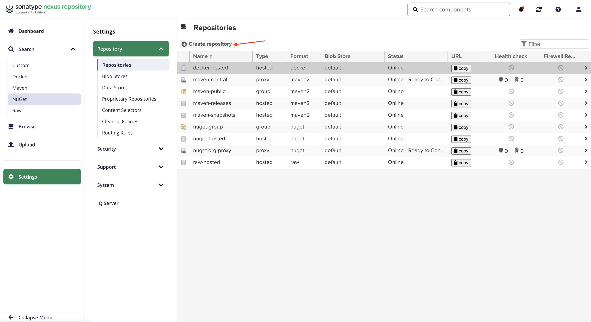

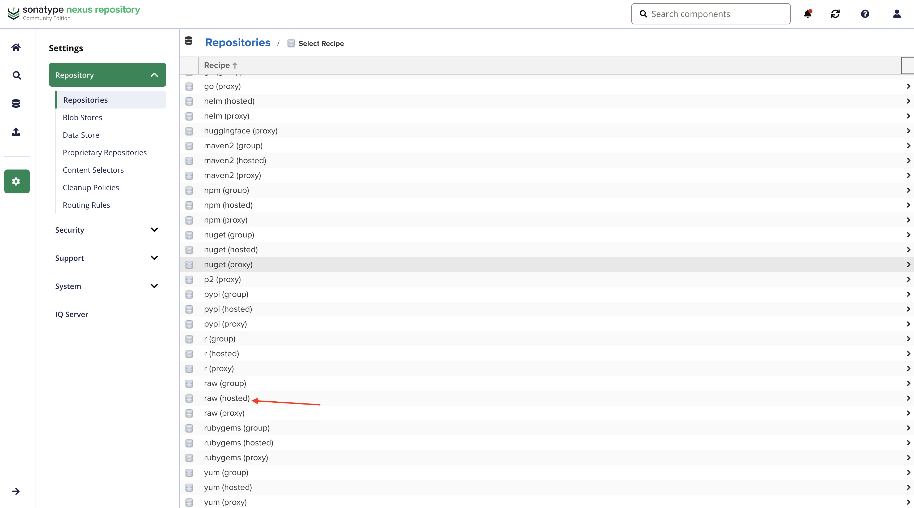

设置页填写名字：raw-hosted，其它默认

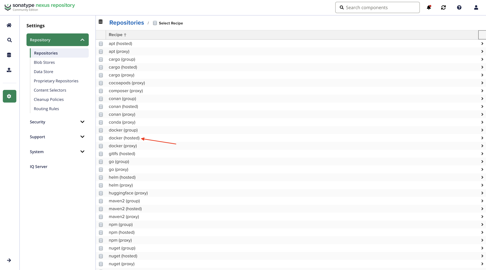

设置页填写名字：docker-hosted，http勾选上并填写8082端口（和docker-compose.yml对应），其它默认

### raw-hosted上传和拉取制品

笔者搭建了一个简单的golang项目：https://gitee.com/awsomeyangtu/go-web-demo

笔者本地基于该项目构建了二进制，保存在仓库目录下bin目录中（注意，二进制文件没有纳入git版本管理），二进制文件名称为：server，如下图所示

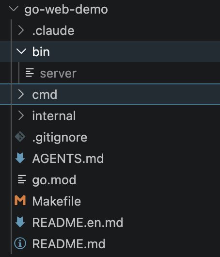

在go-web-demo目录下执行制品上传接口

```bash
curl -u admin:admin -X PUT \
  "http://192.168.10.134:8081/repository/raw-hosted/go-web-demo/server-1.0" \
  --upload-file ./bin/server
```

命令解释

1、admin:admin：是前面nexus设置的账号密码，你可以设置你自己的密码。另外，一般来说建议为制品上传下载单独设置一个账号密码，因为admin权限太大了，这里学习演示就没管

2、`http://192.168.10.134:8081/repository/raw-hosted`，这个是raw-hosted仓库的base_url，看下图

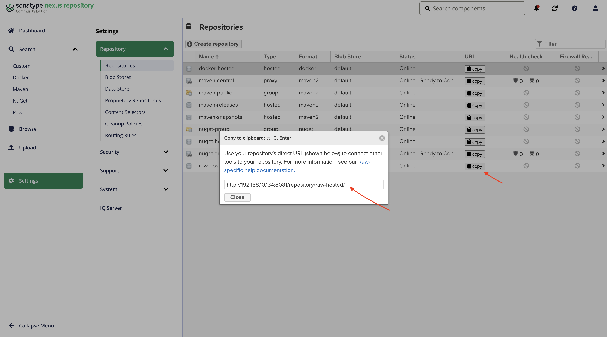

3、/go-web-demo/server-1.0，这个是表示go-web-demo项目的server-1.0版本

4、./bin/server，就是bin目录下的名为server的二进制文件

最终nexus中看到的效果就是

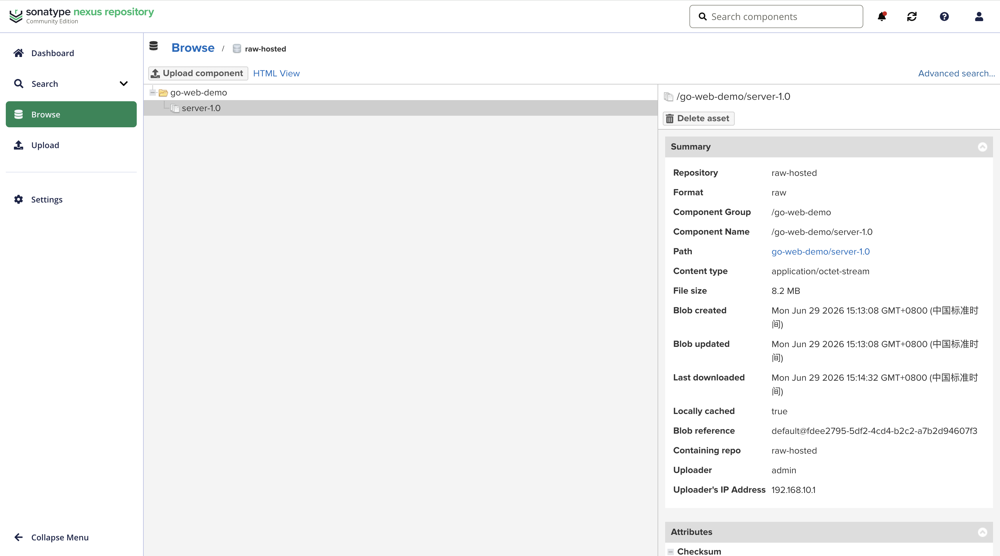

在本地电脑任意一个目录拉取该制品

```bash
curl -u admin:admin -O "http://192.168.10.134:8081/repository/raw-hosted/go-web-demo/server-1.0"
  % Total    % Received % Xferd  Average Speed   Time    Time     Time  Current
                                 Dload  Upload   Total   Spent    Left  Speed
100 8376k  100 8376k    0     0  78.9M      0 --:--:-- --:--:-- --:--:-- 79.4M
```

执行该制品

```bash
chmod +x server-1.0 # 设置为可执行文件
./server-1.0 # 启动项目

# 输出
{"time":"2026-06-29T15:15:08.326804+08:00","level":"INFO","msg":"http server starting","addr":":9000"}

# 测试
curl -X POST http://localhost:9000/api/v1/echo \
  -H 'Content-Type: application/json' \
  -d '{"name":"seayang","age":18,"tags":["go","web"]}'

# 输出
{"code":200,"message":"success","data":{"name":"seayang","age":18,"tags":["go","web"],"greeting":"Hello, seayang! You are 18 years old.","created_at":"2026-07-01T06:55:12Z"}}
```

以上，说明上传下载制品是OK的

### docker-hosted上传和拉取镜像

笔者本地拉取了一个镜像：alpine:3.22

```bash
docker image list
IMAGE                             ID             DISK USAGE   CONTENT SIZE   EXTRA
alpine:3.22                       310c62b5e7ca       13.5MB         4.23MB
```

将该镜像上传到nexus

1、登录：docker login http://192.168.10.134:8082

输入账号密码，输出：Login Succeeded，则说明登录成功

2、重新命名标签

```bash
docker tag alpine:3.22 192.168.10.134:8082/alpine:3.22
```

3、推送

```bash
docker push 192.168.10.134:8082/alpine:3.22
The push refers to repository [192.168.10.134:8082/alpine]
58e777220c39: Pushed
3.22: digest: sha256:a46b5c913cad8b1038883ec9aff6003b4a11fdae3229a8e9e3a68f757d724cef size: 1025

i Info → Not all multiplatform-content is present and only the available single-platform image was pushed
          sha256:310c62b5e7ca5b08167e4384c68db0fd2905dd9c7493756d356e893909057601 -> sha256:a46b5c913cad8b1038883ec9aff6003b4a11fdae3229a8e9e3a68f757d724cef
```

nexus查看

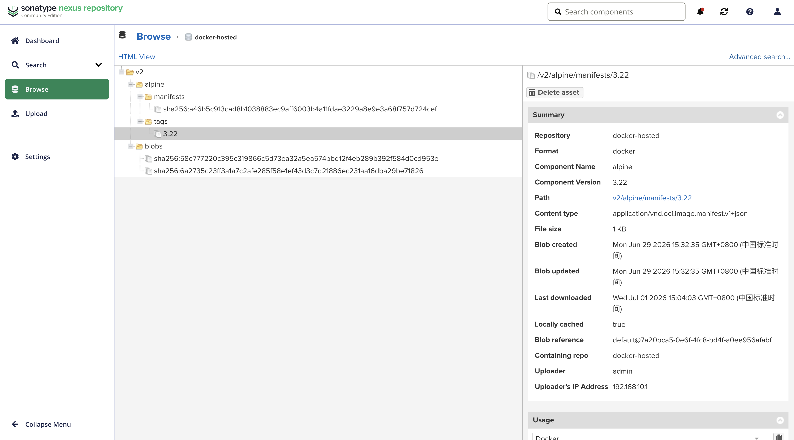

拉取镜像

```bash
docker pull 192.168.10.134:8082/alpine:3.22
3.22: Pulling from alpine
Digest: sha256:a46b5c913cad8b1038883ec9aff6003b4a11fdae3229a8e9e3a68f757d724cef
Status: Image is up to date for 192.168.10.134:8082/alpine:3.22
192.168.10.134:8082/alpine:3.22

What's next:
    View a summary of image vulnerabilities and recommendations → docker scout quickview 192.168.10.134:8082/alpine:3.22
```

查看镜像

```bash
docker image list
IMAGE                             ID             DISK USAGE   CONTENT SIZE   EXTRA
192.168.10.134:8082/alpine:3.22   a46b5c913cad       13.4MB         4.14MB
alpine:3.22                       310c62b5e7ca       13.5MB         4.23MB
```

以上，上传拉取镜像也是OK的
