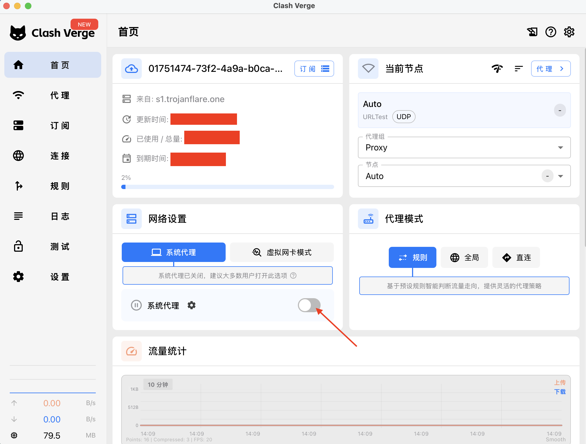
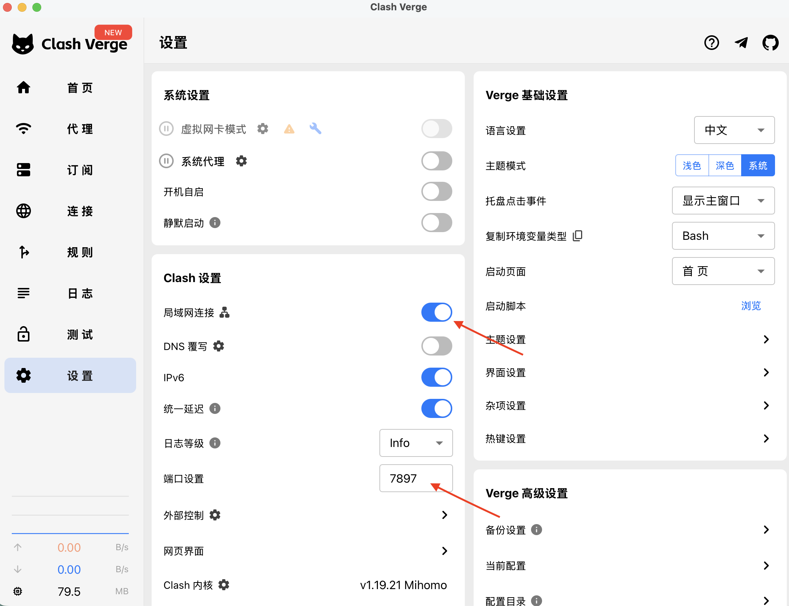
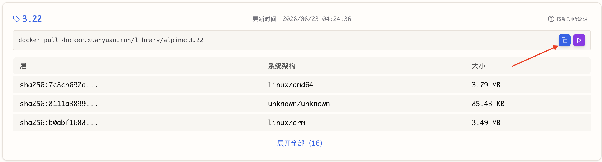
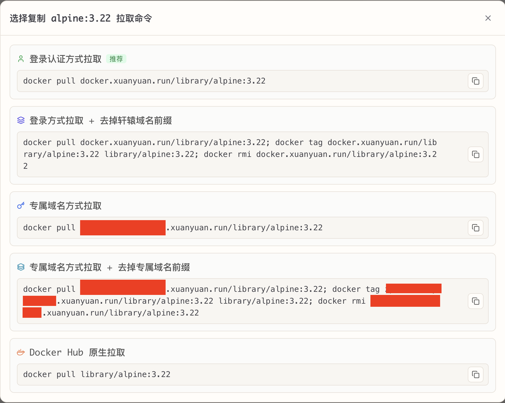

# 解决镜像拉取困难

由于众所周知的国内网络原因，拉取docker镜像一直是个问题，两种方式解决：

- 科学地上网

- 镜像加速

## 科学地上网

提供这类服务和客户端软件的有多种选择，这里只介绍一下客户端软件的一些配置，笔者使用的是：Clash Verge



需要的时候打开：系统代理，不需要的时候关闭即可



笔者本地发现，打开系统代理之后，浏览器端是可以访问google、dockerhub的，但是命令行终端不行，需要在终端设置一下代理

```bash
export ALL_PROXY=socks5h://127.0.0.1:7897
export https_proxy=socks5h://127.0.0.1:7897
export http_proxy=socks5h://127.0.0.1:7897
```

访问google测试一下：

```bash
curl -I https://www.google.com
```

命令输出如下，说明能访问

```bash
HTTP/2 200
content-type: text/html; charset=ISO-8859-1
content-security-policy-report-only: object-src 'none';base-uri 'self';script-src 'nonce-Q2SrD2XtBknj3FN-oIjz_Q' 'strict-dynamic' 'report-sample' 'unsafe-eval' 'unsafe-inline' https: http:;report-uri https://csp.withgoogle.com/csp/gws/other-hp
accept-ch: Sec-CH-Prefers-Color-Scheme
p3p: CP="This is not a P3P policy! See g.co/p3phelp for more info."
date: Tue, 30 Jun 2026 06:25:25 GMT
server: gws
x-xss-protection: 0
x-frame-options: SAMEORIGIN
expires: Tue, 30 Jun 2026 06:25:25 GMT
cache-control: private
set-cookie: AEC=AdJVEat3baJQn5skVwbHDrDkl15YGSH56prmamr-iuNjo16tYqRwRKNinA; expires=Sun, 27-Dec-2026 06:25:25 GMT; path=/; domain=.google.com; Secure; HttpOnly; SameSite=lax
set-cookie: NID=532=g6P3Bu0oKZtbPy7IvqBZo6NvXVf6OZ0BdtHK4mJaqLgjp3tj5k0zZj71JX1EN-8VkGnR3tDYbwDW1gKXclR5dnRCGlXJvwZmpOPQZVIH_MysS8YD9SSl69PN2xFLHYLw888aLTrENWwV292OVeuXuyRX1Ndj7kI_mEJssn9txK70MG3uujFy17ctqpVMx465ZWe8ejEeE48UeF7Xr0c; expires=Wed, 30-Dec-2026 06:25:25 GMT; path=/; domain=.google.com; HttpOnly
set-cookie: __Secure-BUCKET=CMcE; expires=Sun, 27-Dec-2026 06:25:25 GMT; path=/; domain=.google.com; Secure; HttpOnly
alt-svc: h3=":443"; ma=2592000,h3-29=":443"; ma=2592000
```

有两点注意：

1、笔者本地终端设置代理的协议是socks5h://开头，有可能在你本地不是，之前笔者在多台电脑发现似乎不一样，没有细究，如果遇到了按照本文档无效的话，可以问一下AI

2、如果你本地安装了虚拟机，比如ubuntu，你可能希望在虚拟机也能科学地上网，比如需要拉取镜像，此时命令中的ip地址就不是127.0.0.1，而是你本地电脑的ip地址

这种方式整体上感觉没那么方便，尤其在命令行终端中可能比较繁琐甚至也可能比较慢。更推荐镜像加速，笔者使用过两种付费加速，感觉还可以，这里推荐一下

- 轩辕镜像，https://xuanyuan.cloud/

- 毫秒镜像，https://1ms.run/

轩辕镜像感觉镜像资源更丰富一些，这里以它简单介绍一下，比如我们要拉取alpine:3.22，搜索alpine然后搜索3.22版本



点击复制icon



有多种方式拉取，笔者试下来速度挺快的

## 比较

1、镜像加速比较方便，但是一个镜像不是所有版本都有，甚至你需要的镜像它上面并没有

2、第一种方式，理论上所有镜像都可以拉取，对于能访问到本仓库的人来说，大多应该都掌握了这种方式，毕竟github也是经常访问不了或者很慢很慢
